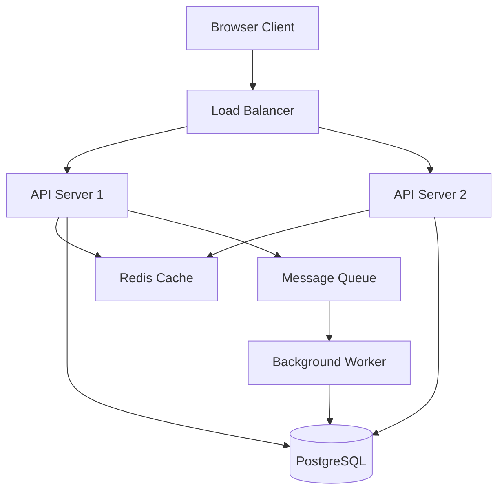
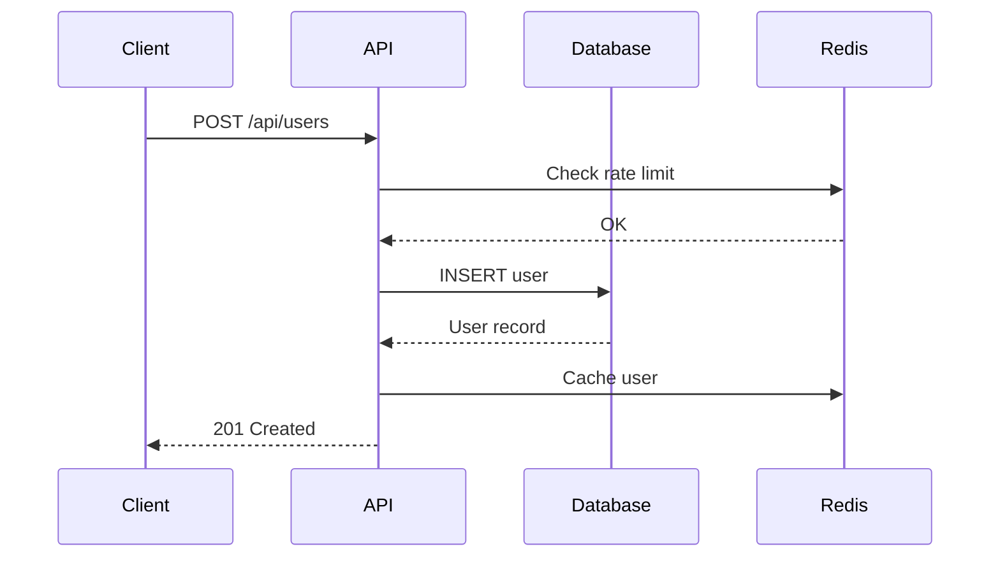
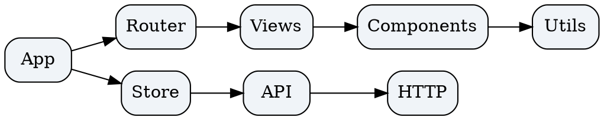

# Building a Modern Web Application

A practical guide to architecting scalable web applications -- from concept to deployment...

---

## Text Formatting

CommonMark supports essential text formatting for **technical writing**. Use *emphasis* for introducing terms, **strong emphasis** for key concepts, and `inline code` for identifiers.

Advanced formatting includes ~~deprecated approaches~~, <u>underlined text</u>, superscript like x^2^ and subscript like H~2~O.

You can combine formats: ***bold and italic***, **`bold code`**, or ~~*strikethrough italic*~~.

---

## Table of Contents

Type `/toc` to insert a Table of Contents block that auto-collects all headings.

---

## Architecture Overview

### Frontend Layer

The frontend communicates with the backend through a REST API. Consider using a component-based framework:

- **React** -- Declarative UI with hooks
- **Vue** -- Progressive framework with reactivity
- **Svelte** -- Compile-time optimized components

### Backend Layer

1. API Gateway -- Request routing and rate limiting
2. Service Layer -- Business logic encapsulation
   1. Authentication Service
   2. Data Processing Service
3. Data Layer -- Database access and caching

### Task Checklist

- [x] Set up project scaffold
- [x] Configure build pipeline
- [ ] Implement authentication
- [ ] Add API endpoints
  - [ ] User management
  - [ ] Content CRUD

---

## Important Notes

> **Note**: CommonMark does not have native callout syntax. This blockquote-based format is the standard fallback for informational notices.

> **Warning**: Always validate user input on the server side, even when client-side validation is in place.

> **Tip**: Use environment variables for configuration values that change between deployments.

---

## Links and References

External links are automatically detected: https://commonmark.org

Use markdown syntax for [named links](https://spec.commonmark.org/). Reference the [CommonMark specification](https://spec.commonmark.org/0.31.2/) for edge cases.

---

## Data Schema

| Field | Type | Required | Description |
|:------|:----:|:--------:|------------:|
| `id` | UUID | Yes | Primary key |
| `name` | string | Yes | Display name |
| `email` | string | Yes | Unique email |
| `role` | enum | No | User role |
| `createdAt` | datetime | Yes | Creation timestamp |

---

## Code Examples

### TypeScript API Handler

```typescript
import express from "express";

interface CreateUserRequest {
  name: string;
  email: string;
  role?: "admin" | "user" | "viewer";
}

const router = express.Router();

router.post("/users", async (req, res) => {
  const { name, email, role = "user" } = req.body as CreateUserRequest;

  const user = await db.users.create({
    data: { name, email, role },
  });

  res.status(201).json(user);
});
```

### SQL Migration

```sql
CREATE TABLE users (
    id UUID PRIMARY KEY DEFAULT gen_random_uuid(),
    name VARCHAR(255) NOT NULL,
    email VARCHAR(255) UNIQUE NOT NULL,
    role VARCHAR(50) DEFAULT 'user',
    created_at TIMESTAMP DEFAULT CURRENT_TIMESTAMP
);

CREATE INDEX idx_users_email ON users(email);
```

---

## Mathematics

Inline math: The time complexity is $O(n \log n)$ for merge sort.

Block equation for the sigmoid activation function:

$$
\sigma(x) = \frac{1}{1 + e^{-x}}
$$

The cross-entropy loss function:

$$
L = -\sum_{i=1}^{N} y_i \log(\hat{y}_i) + (1 - y_i) \log(1 - \hat{y}_i)
$$

---

## System Architecture Diagram



### Request Flow



---

## Dependency Graph



---

## Collapsible Sections

<details>
<summary>Environment Setup</summary>

Install the required dependencies:

```bash
npm install express prisma @prisma/client
npm install -D typescript @types/express
```

Create a `.env` file with your configuration values.

</details>

<details>
<summary>Deployment Checklist</summary>

- Set `NODE_ENV=production`
- Configure database connection string
- Enable HTTPS with valid certificates
- Set up health check endpoints
- Configure log aggregation

</details>

---

## Images

Drag and drop an image or type `/image` to upload:


---

## Mentions

Tag team members like @alice or @bob using the `@` symbol.

---

## Editor Features

### Drag & Drop

Hover over any block to see the drag handle. Reorder blocks by dragging or using **Alt+Arrow** keys.

### Find & Replace

Press `Cmd+F` to find text, `Cmd+Shift+H` for find and replace.

### Keyboard Shortcuts

| Action | Mac | Windows/Linux |
|:-------|:----|:--------------|
| Bold | `⌘+B` | `Ctrl+B` |
| Italic | `⌘+I` | `Ctrl+I` |
| Heading 1 | `⌘+Alt+1` | `Ctrl+Alt+1` |
| Code Block | `⌘+Alt+C` | `Ctrl+Alt+C` |
| Undo | `⌘+Z` | `Ctrl+Z` |

---

*This CommonMark content demonstrates all editor features using standard Markdown syntax.*
