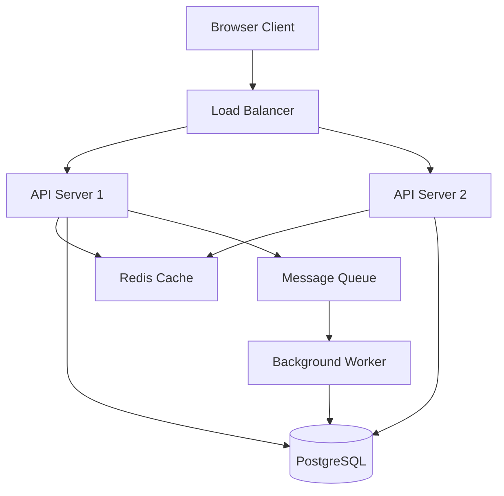
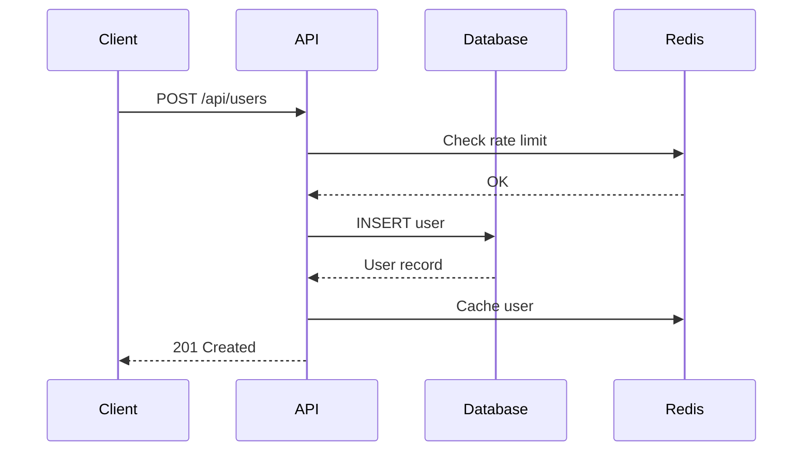
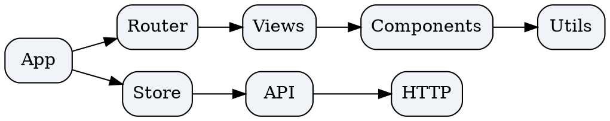

# Building a Modern Web Application

A practical guide to architecting scalable web applications — from initial
concept to production deployment. This document uses standard CommonMark
syntax to demonstrate every editor feature.

Hover any block to reveal its drag handle. Drag to reorder, or click the
handle to open the block menu.

---

## Drag & Drop and Block Reordering

Each block in the document — paragraphs, headings, list items, and task
items — exposes an independent drag handle. The scenarios below verify
reordering across block types and at every nesting depth.

### Paragraphs and Headings

This paragraph is a top-level block. Drag its handle to any position in the
document, or press `Alt+↑` / `Alt+↓` to move it one step.

### Bullet List (Nested)

- Specification phase
- Implementation phase
  - Frontend development
  - Backend development
    - API endpoints
    - Database migrations
  - Integration testing
- Deployment phase

Drag a deeply nested item: the handle anchors to that exact item even as
the cursor approaches, and the drop preserves the tree.

### Ordered List (Nested, Renumbering)

1. Define requirements
2. Design architecture
   1. Frontend layer
   2. Backend layer
   3. Data layer
3. Build and test
4. Deploy to production

Reorder any item and the numbering updates automatically.

### Task List (Nested, State Preservation)

- [x] Bootstrap repository
- [x] Configure tooling
  - [x] Linter
  - [x] Formatter
  - [ ] Pre-commit hooks
- [ ] Implement features
  - [x] User authentication
  - [ ] Content management
    - [ ] Create endpoint
    - [ ] Update endpoint
    - [ ] Delete endpoint
- [ ] Ship release candidate

Each checkbox state moves with its item during drag.

---

## Text Formatting

Select text to reveal the **bubble menu** with inline formatting options.

- **Bold** — `⌘B`
- *Italic* — `⌘I`
- <u>Underline</u> — `⌘U`
- ~~Strikethrough~~ — bubble menu
- `Inline code` — backtick syntax
- Superscript: x^2^ and 10^-3^
- Subscript: H~2~O and CO~2~

Combine formats: ***bold italic***, **`bold code`**, ~~*strike italic*~~.

---

## Headings

Use slash commands (`/heading`) or keyboard shortcuts:

### Heading Level 3 — `⌘⌥3`

- `⌘⌥1` — Heading 1
- `⌘⌥2` — Heading 2
- `⌘⌥3` — Heading 3

---

## Blockquotes

> CommonMark does not have native callout syntax. Use blockquotes with
> emphasis for informational notices.
>
> **Note.** Always validate user input on the server, even when
> client-side validation exists.

> **Warning.** Store configuration values that change between deployments
> in environment variables — never commit them.

> **Tip.** Use structured logging so events can be parsed and aggregated
> by downstream tooling.

---

## Links and References

Links use standard Markdown syntax: [CommonMark specification](https://spec.commonmark.org/0.31.2/),
[specification reference](https://spec.commonmark.org/), and URLs such as
<https://commonmark.org> (autolink brackets).

Mention teammates with `@`: @alice, @bob, or @carol trigger the mention
menu when enabled.

---

## Tables

Column alignment is preserved through Markdown round-trips.

| Field        | Type     | Required | Description           |
|:-------------|:--------:|:--------:|----------------------:|
| `id`         | UUID     |   Yes    | Primary key           |
| `name`       | string   |   Yes    | Display name          |
| `email`      | string   |   Yes    | Unique email address  |
| `role`       | enum     |   No     | `admin`/`user`/`guest`|
| `createdAt`  | datetime |   Yes    | Record creation time  |

---

## Code Blocks

Syntax highlighting is provided by Lowlight (100+ languages).

### TypeScript API Handler

```typescript
import express from "express";

interface CreateUserRequest {
  name: string;
  email: string;
  role?: "admin" | "user" | "viewer";
}

const router = express.Router();

router.post("/users", async (req, res) => {
  const { name, email, role = "user" } = req.body as CreateUserRequest;

  const user = await db.users.create({
    data: { name, email, role },
  });

  res.status(201).json(user);
});
```

### SQL Migration

```sql
CREATE TABLE users (
    id UUID PRIMARY KEY DEFAULT gen_random_uuid(),
    name VARCHAR(255) NOT NULL,
    email VARCHAR(255) UNIQUE NOT NULL,
    role VARCHAR(50) DEFAULT 'user',
    created_at TIMESTAMP DEFAULT CURRENT_TIMESTAMP
);

CREATE INDEX idx_users_email ON users(email);
```

### Shell

```bash
pnpm install express prisma @prisma/client
pnpm install -D typescript @types/express

export NODE_ENV=production
pnpm build && pnpm start
```

---

## Mathematics

Inline: the time complexity of merge sort is $O(n \log n)$ and the space
complexity is $O(n)$.

Sigmoid activation:

$$
\sigma(x) = \frac{1}{1 + e^{-x}}
$$

Cross-entropy loss:

$$
L = -\sum_{i=1}^{N} \left[ y_i \log(\hat{y}_i) + (1 - y_i) \log(1 - \hat{y}_i) \right]
$$

---

## Diagrams

### System Architecture (Mermaid)


```mermaid
flowchart TD
    Client[Browser Client] --> LB[Load Balancer]
    LB --> API1[API Server 1]
    LB --> API2[API Server 2]
    API1 --> Cache[Redis Cache]
    API2 --> Cache
    API1 --> DB[(PostgreSQL)]
    API2 --> DB
    API1 --> Queue[Message Queue]
    Queue --> Worker[Background Worker]
    Worker --> DB
```

### Request Flow (Mermaid Sequence)


```mermaid
sequenceDiagram
    participant C as Client
    participant A as API
    participant D as Database
    participant R as Redis

    C->>A: POST /api/users
    A->>R: Check rate limit
    R-->>A: OK
    A->>D: INSERT user
    D-->>A: User record
    A->>R: Cache user
    A-->>C: 201 Created
```

### Module Dependencies (GraphViz)


```dot
digraph Dependencies {
    rankdir=LR
    node [shape=box, style="rounded,filled", fillcolor="#f0f4f8"]

    App -> Router
    App -> Store
    Router -> Views
    Views -> Components
    Components -> Utils
    Store -> API
    API -> HTTP
}
```

---

## Collapsible Sections

Details blocks hold editable content and their children are individually
draggable.

<details>
<summary>Environment setup</summary>

```bash
pnpm install express prisma @prisma/client
pnpm install -D typescript @types/express
```

Create a `.env` file with your configuration values.

</details>

<details>
<summary>Deployment checklist</summary>

- Set `NODE_ENV=production`
- Configure database connection string
- Enable HTTPS with valid certificates
- Set up health check endpoints
- Configure log aggregation

</details>

---

## Images

Upload via drag-and-drop, clipboard paste, or `/image`. Drag the side
handles on a selected image to resize.


---

## Editor Conveniences

- **Find and Replace** — `⌘F` opens the search panel; `⌘⇧H` adds the
  replace field.
- **Auto-save** — content persists to `localStorage` on every change.
- **Comments** — select text and attach a threaded annotation when the
  Comments panel is enabled.
- **Version History** — snapshot the document and restore any previous
  version from the History panel.
- **Theme toggle** — switch between light, dark, and system themes from
  the header; the editor and all components follow.

### Keyboard Shortcuts

| Action          | Mac          | Windows / Linux  |
|:----------------|:-------------|:-----------------|
| Bold            | `⌘B`         | `Ctrl+B`         |
| Italic          | `⌘I`         | `Ctrl+I`         |
| Underline       | `⌘U`         | `Ctrl+U`         |
| Heading 1 – 3   | `⌘⌥1..3`     | `Ctrl+Alt+1..3`  |
| Code Block      | `⌘⌥C`        | `Ctrl+Alt+C`     |
| Bullet List     | `⌘⇧8`        | `Ctrl+Shift+8`   |
| Ordered List    | `⌘⇧7`        | `Ctrl+Shift+7`   |
| Blockquote      | `⌘⇧B`        | `Ctrl+Shift+B`   |
| Undo / Redo     | `⌘Z` / `⌘⇧Z` | `Ctrl+Z` / `⇧Z`  |
| Find / Replace  | `⌘F` / `⌘⇧H` | `Ctrl+F` / `⇧H`  |
| Move Block      | `⌥↑` / `⌥↓`  | `Alt+↑` / `Alt+↓`|

---

*This CommonMark showcase demonstrates every editor feature using standard
Markdown syntax.*
