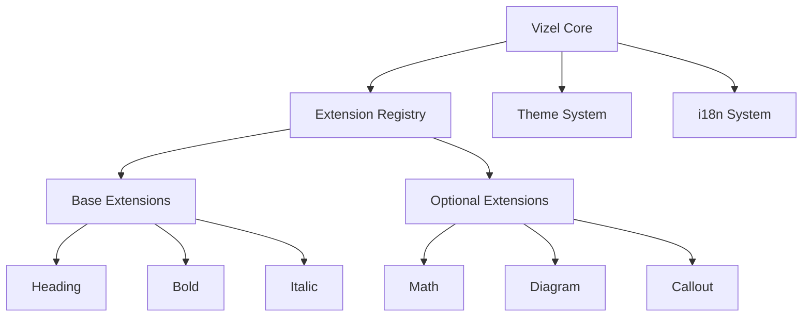
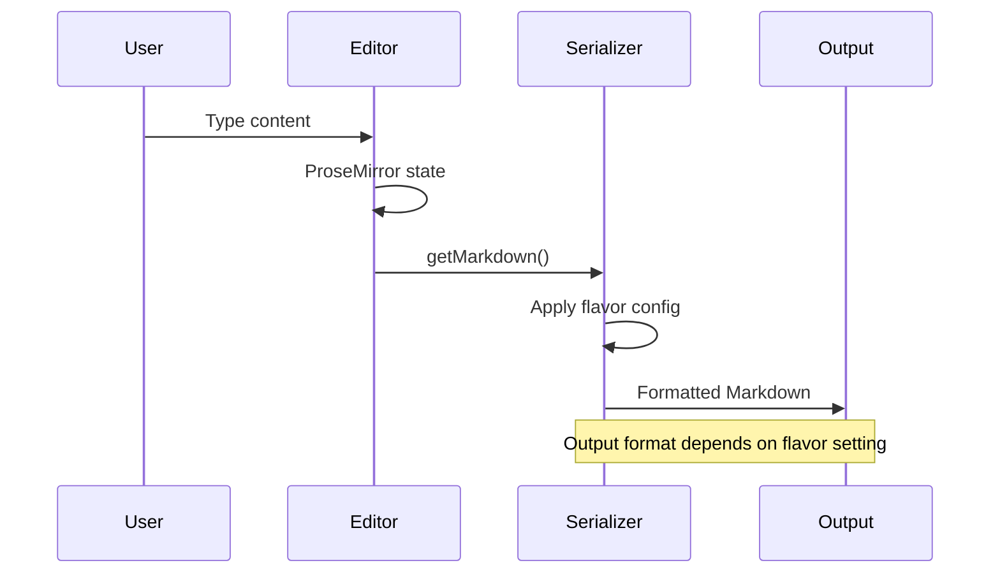
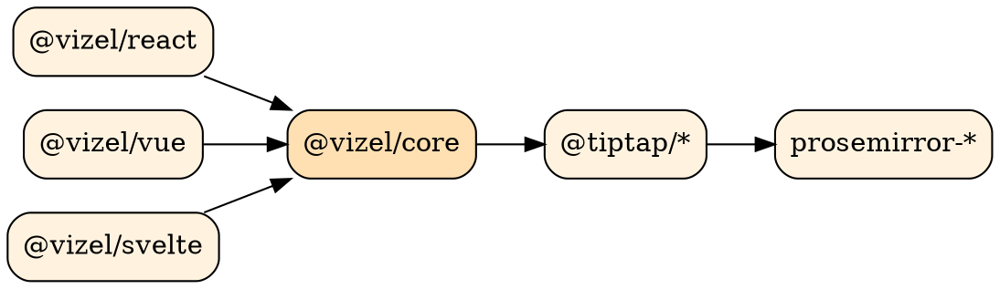

# Vizel API Reference

Complete API documentation for the Vizel editor library -- covering core concepts, configuration, and framework integration...

---

## Text Formatting

The editor supports standard Markdown formatting: **bold**, *italic*, ~~strikethrough~~, <u>underline</u>, and `inline code`.

Extended formatting includes superscript (e.g., 2^10^ = 1024) and subscript (e.g., H~2~SO~4~).

Combine formats as needed: ***bold italic***, **`bold code`**, ~~*strikethrough italic*~~.

---

## Table of Contents

Use `/toc` to insert an auto-generated Table of Contents for long documentation pages.

---

## Core Concepts

### Editor Architecture

The Vizel editor is built on three layers:

- **@vizel/core** -- Framework-agnostic extensions and utilities
- **@vizel/react** / **@vizel/vue** / **@vizel/svelte** -- Framework bindings
- **@tiptap/core** -- Underlying ProseMirror abstraction

### Feature Configuration

1. Define features in `VizelFeatureOptions`
2. Pass to the `Vizel` component via `features` prop
   1. Boolean `true` enables with defaults
   2. Object enables with custom options
3. Extensions are loaded dynamically based on configuration

### Implementation Checklist

- [x] Install core and framework packages
- [x] Configure feature options
- [ ] Customize toolbar actions
- [ ] Add event handlers
  - [ ] `onUpdate` for content sync
  - [ ] `onError` for error handling

---

## Admonitions

:::note
Docusaurus-style admonitions use `:::type` fenced directive syntax. This format is supported by Docusaurus, VitePress, Zenn, and Qiita.
:::

:::tip
Use the `features` prop to enable only the extensions your application needs. This keeps the bundle size minimal.
:::

:::info
All Vizel extensions support Markdown round-tripping. Content can be exported as Markdown and re-imported without data loss.
:::

:::warning
The `diagram` feature requires async loading of Mermaid and Graphviz-WASM. Ensure your bundler supports code splitting for optimal performance.
:::

:::danger
Never render raw HTML from user-generated Markdown without sanitization. Vizel uses DOMPurify internally for oEmbed and diagram output.
:::

---

## Blockquotes

> Vizel aims to be the standard Markdown editor component for modern web frameworks -- providing a rich editing experience with zero configuration.

---

## Links

Auto-detected: https://docusaurus.io

Documentation links: [Docusaurus Markdown Features](https://docusaurus.io/docs/markdown-features) provide the foundation for this flavor's syntax.

---

## API Reference

### VizelFeatureOptions

| Property | Type | Default | Description |
|:---------|:----:|:-------:|:------------|
| `markdown` | `boolean \| object` | `true` | Markdown import/export |
| `mathematics` | `boolean \| object` | `true` | LaTeX math with KaTeX |
| `diagram` | `boolean \| object` | `true` | Mermaid and GraphViz |
| `callout` | `boolean \| object` | `true` | Admonition blocks |
| `embed` | `boolean \| object` | `true` | URL embedding (oEmbed) |
| `mention` | `object` | `false` | @mention autocomplete |
| `superscript` | `boolean` | `true` | Superscript mark |
| `subscript` | `boolean` | `true` | Subscript mark |
| `typography` | `boolean` | `true` | Smart quotes, em-dashes |

### Editor Instance Methods

```typescript
interface Editor {
  // Content
  getMarkdown(): string;
  getJSON(): JSONContent;
  getHTML(): string;

  // Commands
  commands: {
    setContent(content: JSONContent): boolean;
    insertContent(value: string): boolean;
    focus(position?: "start" | "end"): boolean;
  };

  // State
  isEditable: boolean;
  isEmpty: boolean;
  isFocused: boolean;
}
```

---

## Code Examples

### React Integration

```tsx
import { Vizel, type VizelRef } from "@vizel/react";
import { useRef, useState } from "react";

function DocumentEditor() {
  const vizelRef = useRef<VizelRef>(null);
  const [markdown, setMarkdown] = useState("");

  return (
    <Vizel
      ref={vizelRef}
      markdown={markdown}
      onMarkdownChange={setMarkdown}
      features={{
        callout: true,
        mathematics: true,
        diagram: true,
        superscript: true,
        subscript: true,
        typography: true,
      }}
      showToolbar
    />
  );
}
```

### Vue Integration

```vue
<script setup lang="ts">
import { ref } from "vue";
import { Vizel } from "@vizel/vue";

const content = ref("# Documentation");
</script>

<template>
  <Vizel
    v-model:markdown="content"
    :features="{ callout: true, mathematics: true }"
    show-toolbar
  />
</template>
```

### Configuration Object

```json
{
  "features": {
    "markdown": true,
    "mathematics": true,
    "diagram": true,
    "callout": true,
    "embed": true,
    "superscript": true,
    "subscript": true,
    "typography": true,
    "image": {
      "maxFileSize": 5242880,
      "allowedTypes": ["image/png", "image/jpeg", "image/webp"]
    }
  }
}
```

---

## Mathematics

Inline: The Euler-Lagrange equation $\frac{\partial L}{\partial q} - \frac{d}{dt}\frac{\partial L}{\partial \dot{q}} = 0$ governs classical mechanics.

Block equations:

$$
\hat{H}\psi = E\psi
$$

$$
\mathcal{L} = \bar{\psi}(i\gamma^\mu \partial_\mu - m)\psi - \frac{1}{4}F_{\mu\nu}F^{\mu\nu}
$$

---

## Architecture Diagrams

### Plugin System



### Data Flow



### Package Dependencies



---

## Collapsible Details

<details>
<summary>Migration Guide (v1.x to v2.x)</summary>

Breaking changes in v2.0:

- `initialContent` renamed to `initialMarkdown` for clarity
- `onContentChange` split into `onUpdate` and `onMarkdownChange`
- Feature flags now use `VizelFeatureOptions` instead of individual props
- Theme system requires `VizelThemeProvider` wrapper

</details>

<details>
<summary>Troubleshooting</summary>

**Q: Math equations not rendering?**
Ensure `mathematics: true` is set in features. KaTeX is loaded asynchronously.

**Q: Diagrams show raw code?**
Check that `diagram: true` is enabled. Mermaid and Graphviz-WASM load on demand.

**Q: Slash menu not appearing?**
Type `/` at the start of an empty paragraph. The menu requires `slashCommand` feature (enabled by default).

</details>

---

## Images

Upload images via the `/image` command or paste from clipboard:


---

## Mentions

Tag team members for documentation review: @alice (PM), @bob (Engineering), @dave (DevOps).

---

## Editor Capabilities

### Drag & Drop

Every block has a drag handle on hover. Reorder sections with drag-and-drop or **Alt+Arrow** keyboard shortcuts.

### Find & Replace

Use `Cmd+F` for search, `Cmd+Shift+H` for find and replace across the document.

### Keyboard Shortcuts

| Action | Mac | Windows/Linux |
|:-------|:----|:--------------|
| Bold | `⌘+B` | `Ctrl+B` |
| Italic | `⌘+I` | `Ctrl+I` |
| Heading 1 | `⌘+Alt+1` | `Ctrl+Alt+1` |
| Code Block | `⌘+Alt+C` | `Ctrl+Alt+C` |
| Undo | `⌘+Z` | `Ctrl+Z` |
| Find | `⌘+F` | `Ctrl+F` |

---

*This Docusaurus-flavored content demonstrates admonition directives and API documentation patterns.*
