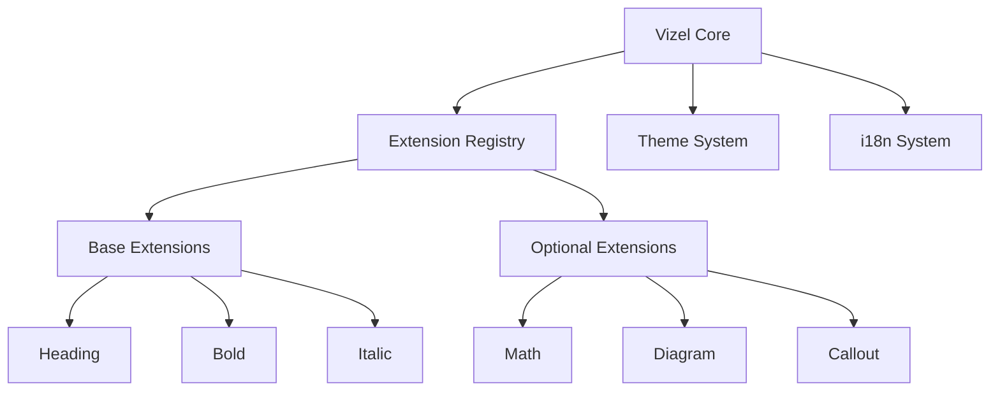
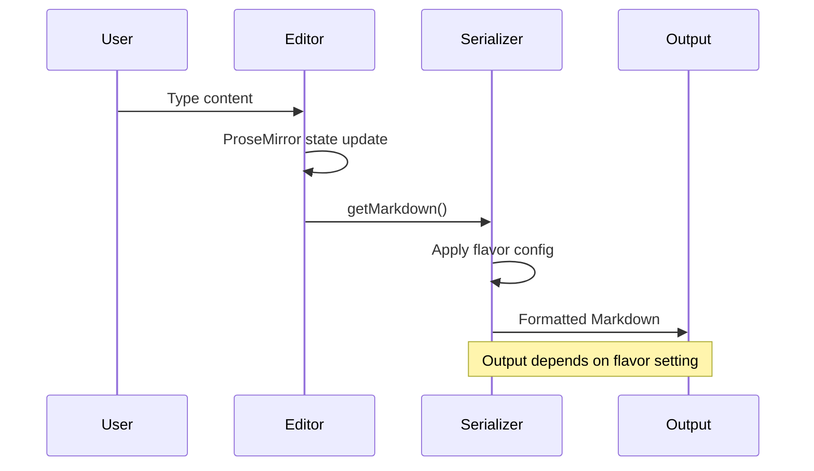
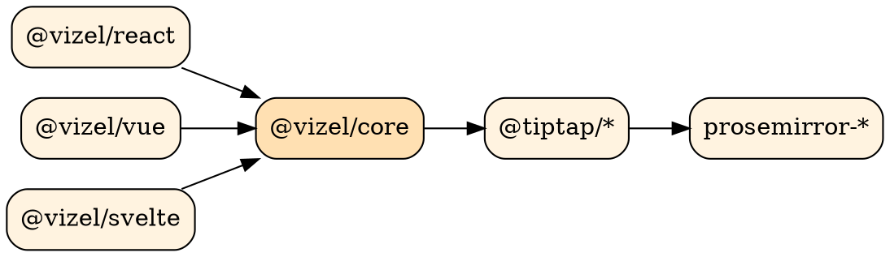

# Vizel API Reference

Complete API documentation for the Vizel editor library — covering core
concepts, configuration, and framework integration. This document uses
Docusaurus-flavor syntax (`:::admonition` directives).

Hover any block to reveal its drag handle. Drag to reorder, or click the
handle to open the block menu.

---

## Drag & Drop and Block Reordering

Each block exposes an independent drag handle — including paragraphs,
headings, list items, and task items. Use the scenarios below to verify
reordering across block types and at every nesting depth.

### Paragraphs and Headings

This paragraph is a top-level block. Drag its handle anywhere in the
document, or press `Alt+↑` / `Alt+↓` to move it one step at a time.

### Bullet List (Nested)

- Core concepts
- Framework integration
  - React bindings
    - Hooks
    - Components
  - Vue bindings
  - Svelte bindings
- Extension authoring

Drag a deeply nested item: the handle anchors to the exact item even as
the cursor approaches, and the drop preserves the tree.

### Ordered List (Nested, Renumbering)

1. Install core and framework packages
2. Configure features
   1. Enable built-ins
   2. Override defaults
   3. Register custom extensions
3. Wire up event handlers
4. Ship to production

Reorder any item and the numbering updates automatically.

### Task List (Nested, State Preservation)

- [x] Install `@vizel/core`
- [x] Install framework adapter
  - [x] React
  - [ ] Vue
  - [ ] Svelte
- [ ] Configure features
  - [x] Markdown round-trip
  - [ ] Mathematics
    - [x] Inline syntax
    - [ ] Block syntax
    - [ ] Custom renderer
- [ ] Add custom toolbar actions

Each checkbox state follows its item during drag.

---

## Text Formatting

Select text to reveal the **bubble menu** with inline formatting options.

- **Bold** — `⌘B`
- *Italic* — `⌘I`
- <u>Underline</u> — `⌘U`
- ~~Strikethrough~~ — bubble menu
- `Inline code` — backtick syntax
- Superscript: 2^10^ = 1024
- Subscript: H~2~SO~4~

Combine formats: ***bold italic***, **`bold code`**, ~~*strike italic*~~.

---

## Headings

Use slash commands (`/heading`) or keyboard shortcuts:

### Heading Level 3 — `⌘⌥3`

- `⌘⌥1` — Heading 1
- `⌘⌥2` — Heading 2
- `⌘⌥3` — Heading 3

---

## Admonitions

Docusaurus-style admonitions use `:::type` fenced directive syntax. The
format is supported by Docusaurus, VitePress, Zenn, and Qiita.

:::note
Admonitions render as colored boxes with icons in Docusaurus and compatible
renderers. Vizel preserves them on Markdown round-trip.
:::

:::tip
Enable only the extensions your application needs via the `features`
prop. This keeps the bundle size minimal.
:::

:::info
Every Vizel extension supports Markdown round-tripping — content can be
exported and re-imported without data loss.
:::

:::warning
The `diagram` feature loads Mermaid and Graphviz-WASM asynchronously.
Ensure your bundler supports code splitting for optimal performance.
:::

:::danger
Never render raw HTML from user-generated Markdown without sanitization.
Vizel uses DOMPurify internally for oEmbed and diagram output.
:::

---

## Blockquotes

> Vizel aims to be the standard Markdown editor component for modern web
> frameworks, providing a rich editing experience with zero configuration
> and predictable Markdown output.

---

## Links

Auto-detected URLs: https://docusaurus.io.

Documentation links: the [Docusaurus Markdown features](https://docusaurus.io/docs/markdown-features)
reference is the foundation for this flavor's syntax.

Mention collaborators with `@`: @alice (PM), @bob (engineering),
@dave (DevOps).

---

## API Reference

### VizelFeatureOptions

| Property       | Type                   | Default | Description              |
|:---------------|:-----------------------|:-------:|:-------------------------|
| `markdown`     | `boolean \| object`    | `true`  | Markdown import/export   |
| `mathematics`  | `boolean \| object`    | `true`  | LaTeX math with KaTeX    |
| `diagram`      | `boolean \| object`    | `true`  | Mermaid and GraphViz     |
| `callout`      | `boolean \| object`    | `true`  | Admonition blocks        |
| `embed`        | `boolean \| object`    | `true`  | URL embedding (oEmbed)   |
| `mention`      | `object`               | `false` | `@`-mention autocomplete |
| `superscript`  | `boolean`              | `true`  | Superscript mark         |
| `subscript`    | `boolean`              | `true`  | Subscript mark           |
| `typography`   | `boolean`              | `true`  | Smart quotes, em-dashes  |

### Editor Instance Methods

```typescript
interface Editor {
  // Content
  getMarkdown(): string;
  getJSON(): JSONContent;
  getHTML(): string;

  // Commands
  commands: {
    setContent(content: JSONContent): boolean;
    insertContent(value: string): boolean;
    focus(position?: "start" | "end"): boolean;
  };

  // State
  isEditable: boolean;
  isEmpty: boolean;
  isFocused: boolean;
}
```

---

## Code Examples

### React Integration

```tsx
import { Vizel, type VizelRef } from "@vizel/react";
import { useRef, useState } from "react";

function DocumentEditor() {
  const ref = useRef<VizelRef>(null);
  const [markdown, setMarkdown] = useState("");

  return (
    <Vizel
      ref={ref}
      markdown={markdown}
      onMarkdownChange={setMarkdown}
      features={{
        callout: true,
        mathematics: true,
        diagram: true,
        superscript: true,
        subscript: true,
        typography: true,
      }}
      showToolbar
    />
  );
}
```

### Vue Integration

```vue
<script setup lang="ts">
import { ref } from "vue";
import { Vizel } from "@vizel/vue";

const content = ref("# Documentation");
</script>

<template>
  <Vizel
    v-model:markdown="content"
    :features="{ callout: true, mathematics: true }"
    show-toolbar
  />
</template>
```

### Svelte Integration

```svelte
<script lang="ts">
  import { Vizel } from "@vizel/svelte";

  let content = $state("# Documentation");
</script>

<Vizel
  bind:markdown={content}
  features={{ callout: true, mathematics: true }}
  showToolbar
/>
```

### Feature Configuration (JSON)

```json
{
  "features": {
    "markdown": true,
    "mathematics": true,
    "diagram": true,
    "callout": true,
    "embed": true,
    "superscript": true,
    "subscript": true,
    "typography": true,
    "image": {
      "maxFileSize": 5242880,
      "allowedTypes": ["image/png", "image/jpeg", "image/webp"]
    }
  }
}
```

---

## Mathematics

Inline: the Euler-Lagrange equation
$\frac{\partial L}{\partial q} - \frac{d}{dt}\frac{\partial L}{\partial \dot{q}} = 0$
governs classical mechanics.

Schrödinger equation:

$$
\hat{H}\psi = E\psi
$$

Standard Model Lagrangian (QED fragment):

$$
\mathcal{L} = \bar{\psi}(i\gamma^\mu \partial_\mu - m)\psi - \frac{1}{4}F_{\mu\nu}F^{\mu\nu}
$$

---

## Architecture Diagrams

### Plugin System (Mermaid)


```mermaid
flowchart TD
    Core[Vizel Core] --> Ext[Extension Registry]
    Ext --> Base[Base Extensions]
    Ext --> Optional[Optional Extensions]
    Base --> Heading & Bold & Italic
    Optional --> Math & Diagram & Callout
    Core --> Theme[Theme System]
    Core --> I18n[i18n System]
```

### Data Flow (Mermaid Sequence)


```mermaid
sequenceDiagram
    participant U as User
    participant E as Editor
    participant S as Serializer
    participant O as Output

    U->>E: Type content
    E->>E: ProseMirror state update
    E->>S: getMarkdown()
    S->>S: Apply flavor config
    S->>O: Formatted Markdown
    Note over S,O: Output depends on flavor setting
```

### Package Dependencies (GraphViz)


```dot
digraph Packages {
    rankdir=LR
    node [shape=box, style="rounded,filled", fillcolor="#fff3e0"]

    Core   [label="@vizel/core", fillcolor="#ffe0b2"]
    React  [label="@vizel/react"]
    Vue    [label="@vizel/vue"]
    Svelte [label="@vizel/svelte"]
    Tiptap [label="@tiptap/*"]
    PM     [label="prosemirror-*"]

    React -> Core
    Vue -> Core
    Svelte -> Core
    Core -> Tiptap
    Tiptap -> PM
}
```

---

## Collapsible Details

Details blocks hold editable content and their children are individually
draggable.

<details>
<summary>Migration guide (v1.x to v2.x)</summary>

Breaking changes in v2.0:

- `initialContent` renamed to `initialMarkdown` for clarity.
- `onContentChange` split into `onUpdate` and `onMarkdownChange`.
- Feature flags use `VizelFeatureOptions` instead of individual props.
- The theme system requires a `VizelThemeProvider` wrapper.

</details>

<details>
<summary>Troubleshooting</summary>

**Math equations not rendering.**
Ensure `mathematics: true` is set in `features`. KaTeX is loaded
asynchronously.

**Diagrams showing raw code.**
Confirm `diagram: true` is enabled. Mermaid and Graphviz-WASM load on
demand.

**Slash menu not appearing.**
Type `/` at the start of an empty paragraph. The menu requires the
`slashCommand` feature (enabled by default).

</details>

---

## Images

Upload via drag-and-drop, clipboard paste, or `/image`. Drag the side
handles on a selected image to resize.


---

## Editor Conveniences

- **Find and Replace** — `⌘F` opens the search panel; `⌘⇧H` adds the
  replace field.
- **Auto-save** — content persists to `localStorage` on every change.
- **Comments** — select text and attach a threaded annotation when the
  Comments panel is enabled.
- **Version History** — snapshot the document and restore any previous
  version from the History panel.
- **Theme toggle** — switch between light, dark, and system themes from
  the header.

### Keyboard Shortcuts

| Action          | Mac          | Windows / Linux  |
|:----------------|:-------------|:-----------------|
| Bold            | `⌘B`         | `Ctrl+B`         |
| Italic          | `⌘I`         | `Ctrl+I`         |
| Underline       | `⌘U`         | `Ctrl+U`         |
| Heading 1 – 3   | `⌘⌥1..3`     | `Ctrl+Alt+1..3`  |
| Code Block      | `⌘⌥C`        | `Ctrl+Alt+C`     |
| Bullet List     | `⌘⇧8`        | `Ctrl+Shift+8`   |
| Ordered List    | `⌘⇧7`        | `Ctrl+Shift+7`   |
| Blockquote      | `⌘⇧B`        | `Ctrl+Shift+B`   |
| Undo / Redo     | `⌘Z` / `⌘⇧Z` | `Ctrl+Z` / `⇧Z`  |
| Find / Replace  | `⌘F` / `⌘⇧H` | `Ctrl+F` / `⇧H`  |
| Move Block      | `⌥↑` / `⌥↓`  | `Alt+↑` / `Alt+↓`|

---

*This Docusaurus-flavored showcase demonstrates admonition directives and
framework integration patterns while exercising every editor feature.*
