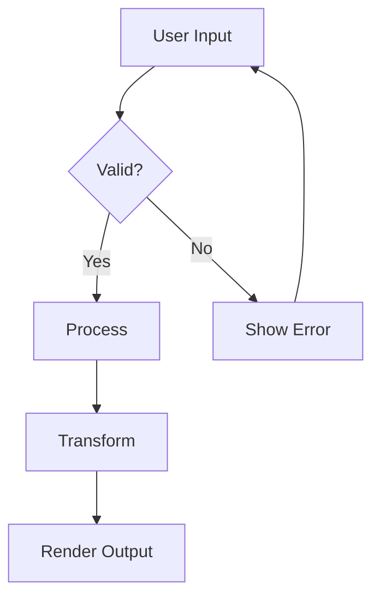
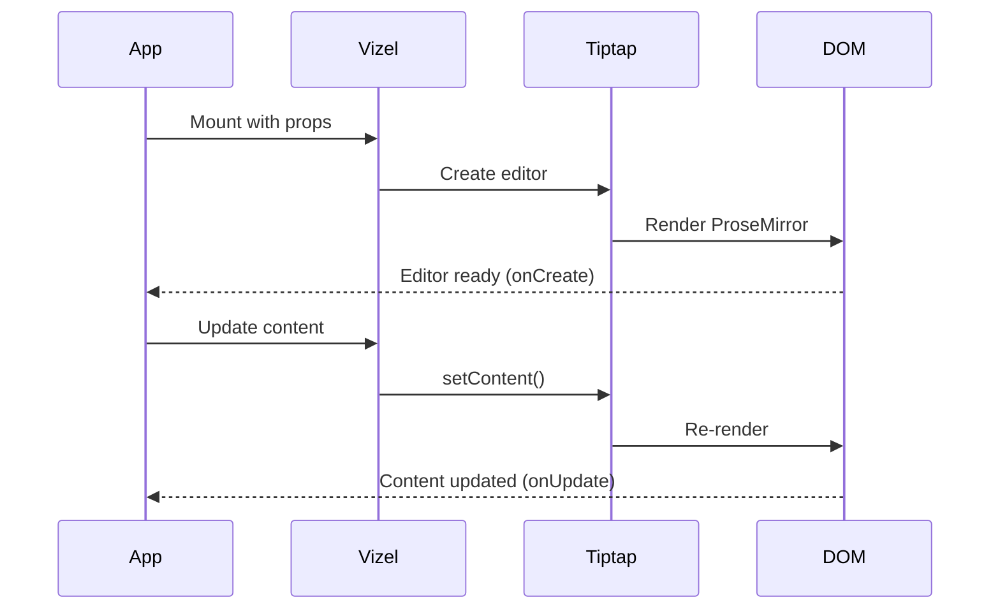
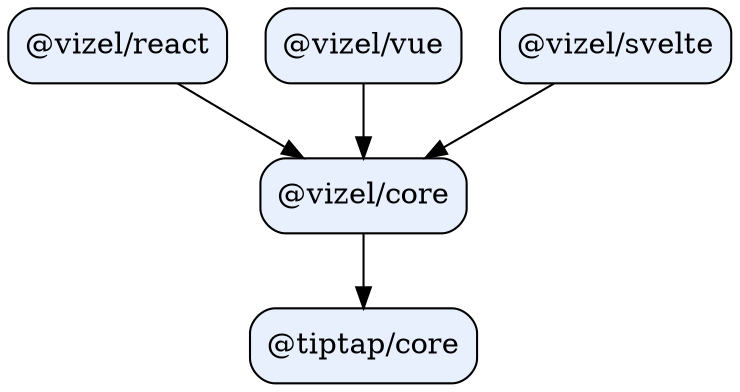

# Vizel Editor

A block-based visual editor for Markdown, supporting React 19, Vue 3, and Svelte 5.

---

## Text Formatting

GFM extends CommonMark with **additional formatting** options. Select text to see the *bubble menu* with formatting tools.

- **Bold** -- `Cmd+B`
- *Italic* -- `Cmd+I`
- ~~Strikethrough~~ -- select and apply
- <u>Underline</u> -- `Cmd+U`
- `Inline code` -- backtick wrapping
- Superscript: E = mc^2^
- Subscript: H~2~O

Combine formats: ***bold italic***, **`bold code`**, ~~*strikethrough italic*~~.

---

## Table of Contents

Insert a Table of Contents with `/toc` -- it auto-collects headings from the document.

---

## Getting Started

### Installation

```bash
npm install @vizel/core @vizel/react
# or
pnpm add @vizel/core @vizel/react
```

### Quick Start

```typescript
import { Vizel } from "@vizel/react";
import type { VizelFeatureOptions } from "@vizel/core";

const features: VizelFeatureOptions = {
  mathematics: true,
  diagram: true,
  embed: true,
  callout: true,
  superscript: true,
  subscript: true,
};

function Editor() {
  return (
    <Vizel
      initialMarkdown="# Hello World"
      features={features}
      showToolbar
    />
  );
}
```

---

## Feature Overview

### Supported Features

| Feature | Status | Slash Command |
|:--------|:------:|:-------------|
| Text Formatting | ✅ | -- |
| Headings (H1-H3) | ✅ | `/heading` |
| Lists (Bullet, Numbered, Task) | ✅ | `/bullet`, `/number`, `/task` |
| Tables | ✅ | `/table` |
| Code Blocks | ✅ | `/code` |
| Mathematics (KaTeX) | ✅ | `/math` |
| Mermaid Diagrams | ✅ | `/mermaid` |
| GraphViz Diagrams | ✅ | `/graphviz` |
| Callouts | ✅ | `/callout` |
| Image Upload | ✅ | `/image` |
| Embeds (YouTube, etc.) | ✅ | `/embed` |
| Collapsible Details | ✅ | `/details` |

### Task List

- [x] Core editor with Tiptap
- [x] Slash command menu
- [x] Bubble menu with formatting
- [x] Multi-framework support
- [ ] AI autocomplete integration
- [ ] Real-time collaboration
  - [ ] Yjs integration
  - [ ] Cursor presence

---

## Alerts

> [!NOTE]
> GFM Alerts are a GitHub-specific extension for callout blocks. They render as colored boxes on GitHub, GitLab, and DEV.to.

> [!TIP]
> Use slash commands by typing `/` anywhere in the editor. The menu supports fuzzy search -- try `/todo` to find Task List.

> [!IMPORTANT]
> Always install `@vizel/core` as a peer dependency alongside the framework package.

> [!WARNING]
> The `diagram` feature loads Mermaid and GraphViz libraries asynchronously. Ensure your bundler supports dynamic imports.

> [!CAUTION]
> Never expose editor content directly in the DOM without sanitization. Use `DOMPurify` for any HTML output.

---

## Blockquotes

> Vizel builds on Tiptap, the headless editor framework for the web.
>
> It provides a complete editing experience with slash commands, inline formatting, and collaborative features.

---

## Links

Links auto-detect when pasted: https://github.com/seijikohara/vizel

Use the bubble menu to [add custom links](https://vizel.dev) with display text.

---

## Code Blocks

### React Component

```tsx
import { Vizel, type VizelRef } from "@vizel/react";
import { useRef } from "react";

function App() {
  const ref = useRef<VizelRef>(null);

  const handleSave = () => {
    const markdown = ref.current?.editor?.getMarkdown();
    console.log(markdown);
  };

  return (
    <>
      <Vizel ref={ref} showToolbar />
      <button onClick={handleSave}>Save</button>
    </>
  );
}
```

### Python

```python
from dataclasses import dataclass
from typing import Optional

@dataclass
class EditorConfig:
    """Configuration for the editor backend."""
    max_document_size: int = 1_000_000
    allowed_extensions: tuple[str, ...] = (".md", ".txt")
    auto_save_interval: Optional[int] = 30

    def validate(self) -> bool:
        return self.max_document_size > 0
```

---

## Mathematics

Inline: The quadratic formula $x = \frac{-b \pm \sqrt{b^2 - 4ac}}{2a}$ solves $ax^2 + bx + c = 0$.

Block equations:

$$
\int_{0}^{\infty} e^{-x^2} dx = \frac{\sqrt{\pi}}{2}
$$

$$
\nabla \times \mathbf{E} = -\frac{\partial \mathbf{B}}{\partial t}
$$

---

## Diagrams

### Architecture



### Component Lifecycle



### Module Graph



---

## Collapsible Details

<details>
<summary>Advanced Configuration</summary>

```typescript
const features: VizelFeatureOptions = {
  codeBlock: {
    defaultLanguage: "typescript",
    lineNumbers: true,
    languages: "all",
  },
  image: {
    onUpload: async (file) => uploadToS3(file),
    maxFileSize: 5 * 1024 * 1024,
  },
  callout: true,
  superscript: true,
  subscript: true,
  typography: true,
};
```

</details>

<details>
<summary>Keyboard Shortcuts Reference</summary>

| Action | Mac | Windows/Linux |
|:-------|:----|:--------------|
| Bold | `⌘+B` | `Ctrl+B` |
| Italic | `⌘+I` | `Ctrl+I` |
| Underline | `⌘+U` | `Ctrl+U` |
| Strikethrough | `⌘+Shift+S` | `Ctrl+Shift+S` |
| Heading 1 | `⌘+Alt+1` | `Ctrl+Alt+1` |
| Heading 2 | `⌘+Alt+2` | `Ctrl+Alt+2` |
| Heading 3 | `⌘+Alt+3` | `Ctrl+Alt+3` |
| Code Block | `⌘+Alt+C` | `Ctrl+Alt+C` |
| Bullet List | `⌘+Shift+8` | `Ctrl+Shift+8` |
| Ordered List | `⌘+Shift+7` | `Ctrl+Shift+7` |
| Task List | -- | -- |
| Blockquote | `⌘+Shift+B` | `Ctrl+Shift+B` |
| Undo | `⌘+Z` | `Ctrl+Z` |
| Redo | `⌘+Shift+Z` | `Ctrl+Shift+Z` |
| Find | `⌘+F` | `Ctrl+F` |
| Replace | `⌘+Shift+H` | `Ctrl+Shift+H` |
| Move Block Up | `Alt+↑` | `Alt+↑` |
| Move Block Down | `Alt+↓` | `Alt+↓` |

</details>

---

## Images

Upload images via drag-and-drop, clipboard paste, or `/image` command:


---

## Mentions

Tag contributors with @alice, @bob, or @carol using the `@` trigger.

---

## Drag & Drop

Hover over any block to reveal the drag handle. Reorder content by dragging or using **Alt+Arrow** shortcuts.

---

*This GFM showcase demonstrates all Vizel features using GitHub Flavored Markdown syntax.*
