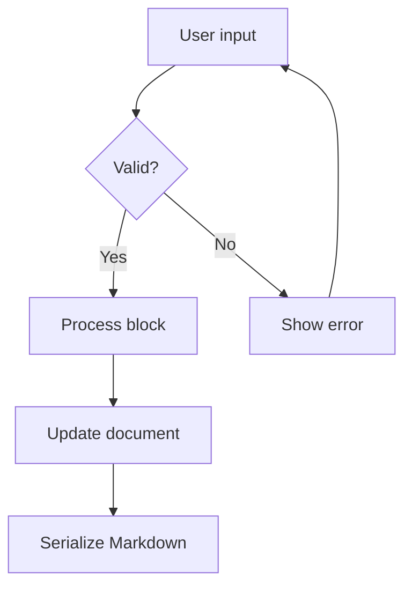
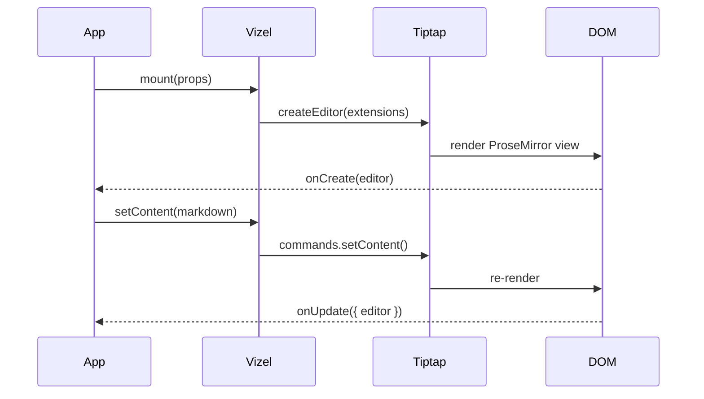
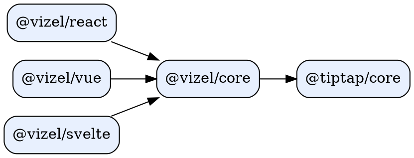

# Vizel Editor

A block-based visual editor for Markdown built on Tiptap, with first-class
support for React 19, Vue 3, and Svelte 5.

Hover any block to reveal its drag handle on the left. Drag the handle to
reorder blocks, or click it to open the block menu.

---

## Drag & Drop and Block Reordering

Each block — paragraphs, headings, list items, and task items — exposes an
independent drag handle. Use the scenarios below to verify reordering works
across every block type and at every nesting depth.

### Paragraphs and Headings

This paragraph is a top-level block. Drag its handle to any position in the
document, or use `Alt+↑` / `Alt+↓` to move it one step at a time.

### Bullet List (Nested)

- Top-level item A
- Top-level item B
  - Nested item B.1
  - Nested item B.2
    - Deeply nested B.2.a
    - Deeply nested B.2.b
  - Nested item B.3
- Top-level item C

Try dragging a deeply nested item: the handle stays anchored to that exact
item even when the cursor approaches it, and the drop preserves the tree
structure.

### Ordered List (Nested, Renumbering)

1. Initialize project
2. Install dependencies
   1. Core packages
   2. Framework adapter
   3. Optional features
3. Configure extensions
4. Build and deploy

Drag any item up or down — the numbering updates automatically.

### Task List (Nested, State Preservation)

- [x] Bootstrap workspace
- [x] Set up tooling
  - [x] Linter
  - [x] Formatter
  - [ ] Type checker
- [ ] Implement features
  - [x] Editor core
  - [ ] Collaboration
    - [ ] Presence
    - [ ] Cursor sync
    - [ ] Conflict resolution
- [ ] Ship release candidate

Each checkbox state moves with its item during drag.

---

## Text Formatting

Select any text to reveal the **bubble menu** with inline formatting options.

- **Bold** — `⌘B`
- *Italic* — `⌘I`
- <u>Underline</u> — `⌘U`
- ~~Strikethrough~~ — bubble menu
- `Inline code` — backtick syntax
- Superscript: `E = mc²`, H^2^O
- Subscript: H~2~O, CO~2~

Combine formats: ***bold italic***, **`bold code`**, ~~*strike italic*~~.

---

## Headings

Use slash commands (`/heading`) or keyboard shortcuts:

### Heading Level 3 — `⌘⌥3`

- `⌘⌥1` — Heading 1
- `⌘⌥2` — Heading 2
- `⌘⌥3` — Heading 3

---

## Links

URLs auto-link when pasted: https://github.com/seijikohara/vizel

Custom display text via the bubble menu: [Vizel documentation](https://seijikohara.github.io/vizel/).

Mention a teammate with `@`: @alice, @bob, or @carol trigger the mention menu.

---

## Blockquotes

> Vizel keeps Tiptap's extensibility while adding block-level affordances
> like drag handles, slash commands, and a bubble menu.
>
> Nested paragraphs inside a blockquote are individually draggable.

---

## GFM Alerts

> [!NOTE]
> GFM alerts render as styled callouts on GitHub, GitLab, and compatible
> renderers. Vizel preserves them on round-trip.

> [!TIP]
> Press `/` anywhere to open the slash command menu. Fuzzy search is
> enabled — `/todo` finds Task List.

> [!IMPORTANT]
> Install `@vizel/core` as a peer dependency alongside the framework
> package (`@vizel/react`, `@vizel/vue`, or `@vizel/svelte`).

> [!WARNING]
> Mermaid and GraphViz extensions load asynchronously. Ensure your bundler
> supports dynamic imports when enabling `features.diagram`.

> [!CAUTION]
> Never insert untrusted HTML into editor content. Sanitize with
> `DOMPurify` before passing any external markup.

---

## Tables

Hover a cell border to insert rows or columns. Column alignment is
preserved through Markdown round-trips.

| Feature          | Status | Slash Command        |
|:-----------------|:------:|:---------------------|
| Headings         |   ✅   | `/heading`           |
| Bullet List      |   ✅   | `/bullet`            |
| Ordered List    |   ✅   | `/number`            |
| Task List        |   ✅   | `/task`              |
| Tables           |   ✅   | `/table`             |
| Code Block       |   ✅   | `/code`              |
| Mathematics      |   ✅   | `/math`              |
| Mermaid Diagram  |   ✅   | `/mermaid`           |
| GraphViz Diagram |   ✅   | `/graphviz`          |
| Callout          |   ✅   | `/callout`           |
| Image Upload     |   ✅   | `/image`             |
| Embed            |   ✅   | `/embed`             |
| Details          |   ✅   | `/details`           |

---

## Code Blocks

Syntax highlighting supports 100+ languages via Lowlight. Select a language
from the dropdown or omit it for plain text.

### TypeScript

```tsx
import { Vizel, type VizelRef } from "@vizel/react";
import { useRef } from "react";

function App() {
  const ref = useRef<VizelRef>(null);

  const handleSave = () => {
    const markdown = ref.current?.editor?.getMarkdown();
    console.log(markdown);
  };

  return (
    <>
      <Vizel ref={ref} showToolbar />
      <button type="button" onClick={handleSave}>Save</button>
    </>
  );
}
```

### Python

```python
from dataclasses import dataclass
from typing import Optional

@dataclass
class EditorConfig:
    """Configuration for the editor backend."""
    max_document_size: int = 1_000_000
    allowed_extensions: tuple[str, ...] = (".md", ".txt")
    auto_save_interval: Optional[int] = 30

    def validate(self) -> bool:
        return self.max_document_size > 0
```

### SQL

```sql
SELECT
    u.name,
    COUNT(o.id) AS order_count,
    SUM(o.total) AS total_spent
FROM users u
LEFT JOIN orders o ON u.id = o.user_id
WHERE o.created_at >= '2026-01-01'
GROUP BY u.id
HAVING total_spent > 1000
ORDER BY total_spent DESC;
```

---

## Mathematics

Inline math: the quadratic formula $x = \frac{-b \pm \sqrt{b^2 - 4ac}}{2a}$
solves $ax^2 + bx + c = 0$.

Block equations render in their own block and are individually draggable:

$$
\int_{-\infty}^{\infty} e^{-x^2} \, dx = \sqrt{\pi}
$$

$$
\nabla \times \mathbf{E} = -\frac{\partial \mathbf{B}}{\partial t}
$$

$$
\sum_{n=1}^{\infty} \frac{1}{n^2} = \frac{\pi^2}{6}
$$

---

## Diagrams

### Flowchart (Mermaid)


```mermaid
flowchart TD
    A[User input] --> B{Valid?}
    B -->|Yes| C[Process block]
    B -->|No| D[Show error]
    C --> E[Update document]
    E --> F[Serialize Markdown]
    D --> A
```

### Sequence (Mermaid)


```mermaid
sequenceDiagram
    participant App
    participant Vizel
    participant Tiptap
    participant DOM

    App->>Vizel: mount(props)
    Vizel->>Tiptap: createEditor(extensions)
    Tiptap->>DOM: render ProseMirror view
    DOM-->>App: onCreate(editor)
    App->>Vizel: setContent(markdown)
    Vizel->>Tiptap: commands.setContent()
    Tiptap->>DOM: re-render
    DOM-->>App: onUpdate({ editor })
```

### Dependency Graph (GraphViz)


```dot
digraph Vizel {
    rankdir=LR
    node [shape=box, style="rounded,filled", fillcolor="#e8f0fe"]

    Core  [label="@vizel/core"]
    React [label="@vizel/react"]
    Vue   [label="@vizel/vue"]
    Svelte [label="@vizel/svelte"]
    Tiptap [label="@tiptap/core"]

    React -> Core
    Vue -> Core
    Svelte -> Core
    Core -> Tiptap
}
```

---

## Collapsible Details

Details blocks contain editable content. Nested blocks inside them also
expose drag handles.

<details>
<summary>Keyboard shortcuts</summary>

| Action          | Mac          | Windows / Linux  |
|:----------------|:-------------|:-----------------|
| Bold            | `⌘B`         | `Ctrl+B`         |
| Italic          | `⌘I`         | `Ctrl+I`         |
| Underline       | `⌘U`         | `Ctrl+U`         |
| Strikethrough   | `⌘⇧S`        | `Ctrl+Shift+S`   |
| Heading 1 – 3   | `⌘⌥1..3`     | `Ctrl+Alt+1..3`  |
| Code Block      | `⌘⌥C`        | `Ctrl+Alt+C`     |
| Bullet List     | `⌘⇧8`        | `Ctrl+Shift+8`   |
| Ordered List    | `⌘⇧7`        | `Ctrl+Shift+7`   |
| Blockquote      | `⌘⇧B`        | `Ctrl+Shift+B`   |
| Undo / Redo     | `⌘Z` / `⌘⇧Z` | `Ctrl+Z` / `⇧Z`  |
| Find / Replace  | `⌘F` / `⌘⇧H` | `Ctrl+F` / `⇧H`  |
| Move Block      | `⌥↑` / `⌥↓`  | `Alt+↑` / `Alt+↓`|

</details>

<details>
<summary>Advanced feature configuration</summary>

```typescript
import type { VizelFeatureOptions } from "@vizel/core";

const features: VizelFeatureOptions = {
  codeBlock: {
    defaultLanguage: "typescript",
    lineNumbers: true,
    languages: "all",
  },
  image: {
    onUpload: async (file) => uploadToS3(file),
    maxFileSize: 5 * 1024 * 1024,
  },
  mathematics: true,
  diagram: true,
  embed: true,
  callout: true,
  superscript: true,
  subscript: true,
  typography: true,
};
```

</details>

---

## Images

Upload via drag-and-drop, clipboard paste, or `/image`. Drag the side
handles on a selected image to resize.


---

## Editor Conveniences

- **Find and Replace** — `⌘F` opens the search panel; `⌘⇧H` adds the
  replace field.
- **Auto-save** — content persists to `localStorage` on every change; look
  for the save indicator beneath the editor.
- **Comments** — select text and add a threaded annotation (enable the
  Comments panel).
- **Version History** — snapshot the document at any point and restore or
  delete versions (enable the History panel).
- **Theme toggle** — switch between light, dark, and system themes from the
  header; the editor and all components follow.

---

*Start editing anywhere to try the features. All blocks are draggable, the
bubble menu follows text selections, and slash commands are one `/` away.*
