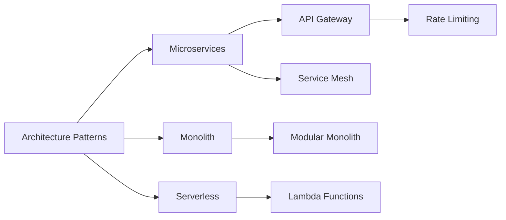
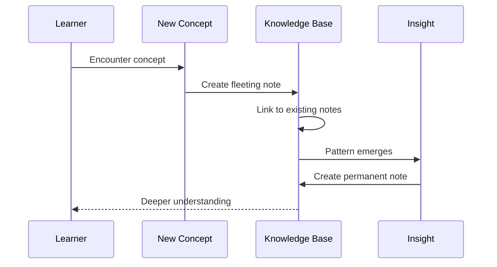
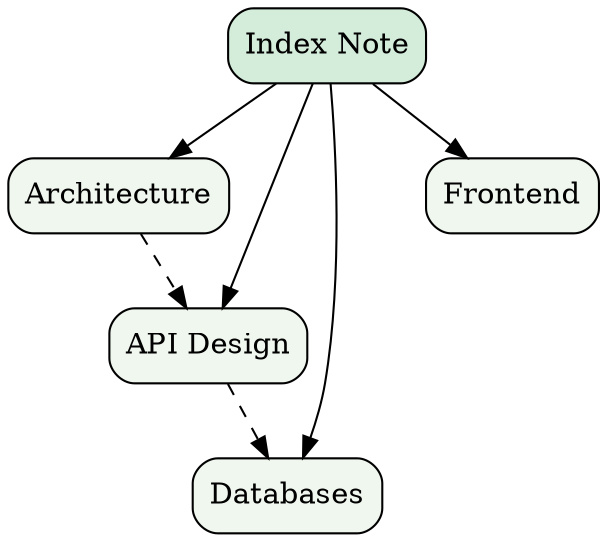

# Knowledge Management with Vizel

A guide to building a personal knowledge base -- using wiki links, callouts, and structured notes...

---

## Text Formatting

Effective note-taking relies on clear formatting. Use **bold** for key terms, *italics* for emphasis, and `code` for technical identifiers.

Additional formatting: ~~deprecated info~~, <u>underlined</u>, superscript like x^2^, and subscript like CO~2~.

Mix formats freely: ***bold italic***, **`bold code`**, ~~*strikethrough italic*~~.

---

## Table of Contents

Type `/toc` to insert a dynamic Table of Contents that updates as you add headings.

---

## Note Structure

### The Zettelkasten Method

A Zettelkasten (slip box) organizes knowledge through interconnected notes:

- **Fleeting Notes** -- Quick captures of ideas
- **Literature Notes** -- Summaries from sources
- **Permanent Notes** -- Refined, standalone ideas

### Linking Strategy

1. Create atomic notes with single ideas
2. Link related concepts with wiki links
   1. Forward links to expand topics
   2. Backlinks to provide context
3. Review and refine connections regularly

### Note Status Tracker

- [x] Capture initial ideas
- [x] Link to existing notes
- [ ] Refine and expand
- [ ] Create index note
  - [ ] Add topic clusters

---

## Wiki Links

Wiki links create connections between notes in your knowledge base:

- Basic link: [[getting-started]]
- Display text: [[getting-started|Getting Started Guide]]
- Topic links: [[architecture-patterns]], [[design-principles]]

Navigate between notes by clicking wiki links. Type `[[` to trigger autocomplete.

---

## Callouts

> [!note]
> Obsidian-style callouts use lowercase type identifiers. They render as colored boxes with icons in Obsidian, Logseq, and Foam.

> [!tip]
> Use wiki links extensively to build a connected knowledge graph. The more links you create, the more valuable your knowledge base becomes.

> [!warning]
> Avoid creating notes that are too long. Atomic notes with focused topics are easier to link and discover.

> [!info]
> This editor supports all five callout types: note, tip, warning, info, and danger. Each has a distinct color and icon.

> [!danger]
> Never store sensitive credentials in your knowledge base. Use a dedicated password manager for secrets.

---

## Blockquotes

> "The best way to learn is to teach." -- Richard Feynman
>
> Building a knowledge base forces you to articulate and refine your understanding.

---

## Links and References

External references: https://obsidian.md

Combine external links with internal wiki links for a comprehensive reference system. See [[architecture-patterns]] for design guidance or visit the [Obsidian documentation](https://help.obsidian.md/).

---

## Reference Tables

| Concept | Related Notes | Status |
|:--------|:------------:|-------:|
| REST API | [[api-design]] | Active |
| GraphQL | [[api-design]] | Draft |
| WebSockets | [[real-time]] | Planned |
| gRPC | [[microservices]] | Active |

---

## Code Snippets

### JavaScript -- Event System

```javascript
class EventEmitter {
  #listeners = new Map();

  on(event, callback) {
    if (!this.#listeners.has(event)) {
      this.#listeners.set(event, new Set());
    }
    this.#listeners.get(event).add(callback);
    return () => this.off(event, callback);
  }

  off(event, callback) {
    this.#listeners.get(event)?.delete(callback);
  }

  emit(event, ...args) {
    for (const cb of this.#listeners.get(event) ?? []) {
      cb(...args);
    }
  }
}
```

### YAML -- Configuration

```yaml
knowledge_base:
  name: "Personal Notes"
  features:
    - wiki_links
    - callouts
    - diagrams
    - math
  settings:
    auto_save: true
    sync_interval: 30s
    max_note_size: 1MB
```

---

## Mathematics

Inline: Euler's identity states $e^{i\pi} + 1 = 0$.

Block equation -- the normal distribution:

$$
f(x) = \frac{1}{\sigma\sqrt{2\pi}} e^{-\frac{(x-\mu)^2}{2\sigma^2}}
$$

Bayes' theorem:

$$
P(A|B) = \frac{P(B|A) \cdot P(A)}{P(B)}
$$

---

## Knowledge Graph



### Learning Progression



### Note Taxonomy



---

## Collapsible Details

<details>
<summary>Note-Taking Best Practices</summary>

- Write in your own words -- avoid copy-paste
- One idea per note for maximum linkability
- Use descriptive titles that work as link text
- Add context: why is this important?
- Review and refine notes periodically

</details>

<details>
<summary>Recommended Plugins</summary>

| Plugin | Purpose |
|:-------|:--------|
| Graph View | Visualize note connections |
| Backlinks | See which notes reference the current one |
| Templates | Consistent note structure |
| Daily Notes | Timestamped journal entries |

</details>

---

## Images

Embed reference images with `/image` or paste from clipboard:


---

## Mentions

Collaborate with team members: @alice for architecture reviews, @carol for design feedback.

---

## Editor Features

### Drag & Drop

Reorganize your notes by dragging blocks. Use **Alt+Arrow** for quick reordering.

### Find & Replace

Search across your note with `Cmd+F`. Replace with `Cmd+Shift+H`.

### Keyboard Shortcuts

| Action | Mac | Windows/Linux |
|:-------|:----|:--------------|
| Bold | `⌘+B` | `Ctrl+B` |
| Italic | `⌘+I` | `Ctrl+I` |
| Wiki Link | `[[` | `[[` |
| Heading 1 | `⌘+Alt+1` | `Ctrl+Alt+1` |
| Code Block | `⌘+Alt+C` | `Ctrl+Alt+C` |
| Find | `⌘+F` | `Ctrl+F` |

---

*This Obsidian-flavored showcase demonstrates wiki links, callouts, and knowledge-base features.*
