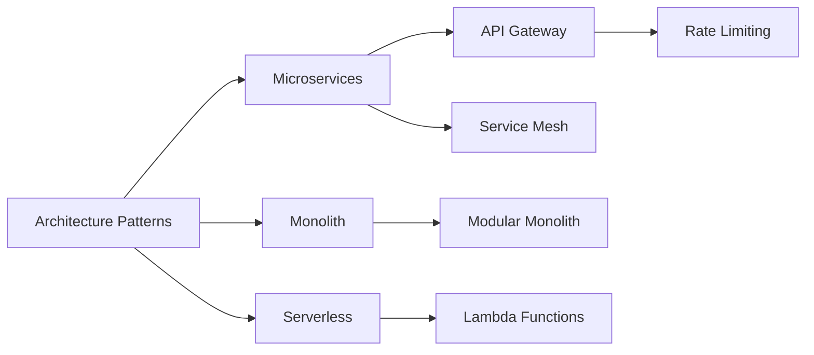
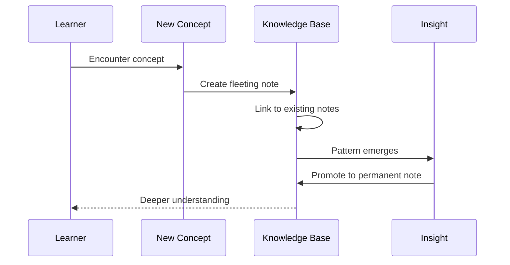
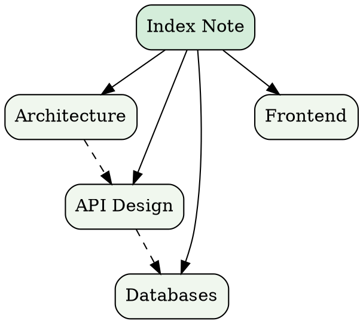

# Knowledge Management with Vizel

A guide to building a personal knowledge base — using wiki links, Obsidian
callouts, and structured atomic notes. This document uses Obsidian-flavor
syntax (`[[wiki-links]]` and `> [!callout]` lowercase types).

Hover any block to reveal its drag handle. Drag to reorder, or click the
handle to open the block menu.

---

## Drag & Drop and Block Reordering

Each block exposes an independent drag handle — including paragraphs,
headings, list items, and task items. Use the scenarios below to verify
reordering at every nesting depth.

### Paragraphs and Headings

This paragraph is a top-level block. Drag its handle to any position, or
press `Alt+↑` / `Alt+↓` to move it one step at a time.

### Bullet List (Nested)

- Fleeting notes
- Literature notes
  - Books
    - Fiction
    - Non-fiction
  - Articles
  - Podcasts
- Permanent notes

Drag a deeply nested item: the handle anchors to the exact item even as
the cursor approaches, and the drop preserves the tree.

### Ordered List (Nested, Renumbering)

1. Capture the idea
2. Link to existing notes
   1. Forward links
   2. Backlinks
3. Refine over time
4. Promote to a permanent note

Reorder any item and the numbering updates automatically.

### Task List (Nested, State Preservation)

- [x] Set up vault
- [x] Define folder structure
  - [x] Inbox
  - [x] Permanent
  - [ ] Archive
- [ ] Migrate existing notes
  - [x] Journal
  - [ ] Research
    - [x] Papers (2024)
    - [ ] Papers (2025)
    - [ ] Talks
- [ ] Establish weekly review

Each checkbox state follows its item during drag.

---

## Text Formatting

Select text to reveal the **bubble menu** with inline formatting options.

- **Bold** for key terms — `⌘B`
- *Italic* for emphasis — `⌘I`
- <u>Underline</u> — `⌘U`
- ~~Strikethrough~~ for outdated info
- `Inline code` for identifiers
- Superscript: x^2^ and 10^-3^
- Subscript: H~2~O and CO~2~

Combine formats: ***bold italic***, **`bold code`**, ~~*strike italic*~~.

---

## Headings

Use slash commands (`/heading`) or keyboard shortcuts:

### Heading Level 3 — `⌘⌥3`

- `⌘⌥1` — Heading 1
- `⌘⌥2` — Heading 2
- `⌘⌥3` — Heading 3

---

## Wiki Links

Wiki links connect atomic notes in your knowledge base. Type `[[` to
trigger autocomplete.

- Basic link: [[getting-started]]
- Display text: [[getting-started|Getting Started Guide]]
- Topic clusters: [[architecture-patterns]], [[design-principles]],
  [[evaluation-criteria]]

Click a wiki link to navigate. Wiki links round-trip losslessly when
exporting to Markdown.

---

## Obsidian Callouts

Obsidian-style callouts use lowercase type identifiers in
`> [!type]` blockquote directives.

> [!note]
> Obsidian callouts render as colored boxes with icons in Obsidian,
> Logseq, and Foam. Vizel preserves them on round-trip.

> [!tip]
> Build a connected knowledge graph by linking aggressively. The more
> connections, the more insight emerges.

> [!info]
> Vizel supports five callout types: `note`, `tip`, `info`, `warning`,
> `danger`. Each has a distinct color and icon.

> [!warning]
> Keep atomic notes small and single-purpose. Large notes resist linking
> and are harder to rediscover.

> [!danger]
> Never commit personal credentials or private keys to a notes vault.
> Use a dedicated password manager.

---

## Blockquotes

> "The best way to learn is to teach." — Richard Feynman
>
> Articulating knowledge in writing forces you to confront gaps in your
> understanding.

---

## Links

Auto-detected URLs: https://obsidian.md.

Combine external links with internal wiki links: see
[[architecture-patterns]] for design guidance, or visit the
[Obsidian documentation](https://help.obsidian.md/).

Mention collaborators with `@`: @alice, @bob, or @carol.

---

## Reference Tables

Column alignment is preserved through Markdown round-trips.

| Concept        | Related Notes              | Status   |
|:---------------|:---------------------------|---------:|
| REST API       | [[api-design]]             | Active   |
| GraphQL        | [[api-design]]             | Draft    |
| WebSockets     | [[real-time-sync]]         | Planned  |
| gRPC           | [[microservices]]          | Active   |
| Server-Sent    | [[event-streams]]          | Draft    |

---

## Code Snippets

### JavaScript — Event System

```javascript
class EventEmitter {
  #listeners = new Map();

  on(event, callback) {
    if (!this.#listeners.has(event)) {
      this.#listeners.set(event, new Set());
    }
    this.#listeners.get(event).add(callback);
    return () => this.off(event, callback);
  }

  off(event, callback) {
    this.#listeners.get(event)?.delete(callback);
  }

  emit(event, ...args) {
    for (const cb of this.#listeners.get(event) ?? []) {
      cb(...args);
    }
  }
}
```

### YAML — Vault Configuration

```yaml
vault:
  name: "Personal Knowledge Base"
  features:
    - wiki_links
    - callouts
    - backlinks
    - graph_view
  settings:
    auto_save: true
    sync_interval: 30s
    max_note_size: 1MB
```

---

## Mathematics

Inline: Euler's identity states $e^{i\pi} + 1 = 0$.

Normal distribution:

$$
f(x) = \frac{1}{\sigma\sqrt{2\pi}} e^{-\frac{(x-\mu)^2}{2\sigma^2}}
$$

Bayes' theorem:

$$
P(A \mid B) = \frac{P(B \mid A) \cdot P(A)}{P(B)}
$$

---

## Diagrams

### Knowledge Graph (Mermaid)


```mermaid
flowchart LR
    A[Architecture Patterns] --> B[Microservices]
    A --> C[Monolith]
    A --> D[Serverless]
    B --> E[API Gateway]
    B --> F[Service Mesh]
    C --> G[Modular Monolith]
    D --> H[Lambda Functions]
    E --> I[Rate Limiting]
```

### Learning Progression (Mermaid Sequence)


```mermaid
sequenceDiagram
    participant L as Learner
    participant N as New Concept
    participant KB as Knowledge Base
    participant I as Insight

    L->>N: Encounter concept
    N->>KB: Create fleeting note
    KB->>KB: Link to existing notes
    KB->>I: Pattern emerges
    I->>KB: Promote to permanent note
    KB-->>L: Deeper understanding
```

### Note Taxonomy (GraphViz)


```dot
digraph Notes {
    rankdir=TB
    node [shape=box, style="rounded,filled", fillcolor="#f0f7ee"]

    Index [label="Index Note", fillcolor="#d4edda"]
    Arch  [label="Architecture"]
    API   [label="API Design"]
    DB    [label="Databases"]
    FE    [label="Frontend"]

    Index -> Arch
    Index -> API
    Index -> DB
    Index -> FE
    Arch -> API [style=dashed]
    API -> DB [style=dashed]
}
```

---

## Collapsible Details

Details blocks hold editable content and their children are individually
draggable.

<details>
<summary>Note-taking best practices</summary>

- Write in your own words — avoid copy-paste
- One idea per note for maximum linkability
- Use descriptive titles that work as link text
- Add context: why is this idea important?
- Review and refine notes periodically

</details>

<details>
<summary>Recommended plugins</summary>

| Plugin      | Purpose                                      |
|:------------|:---------------------------------------------|
| Graph View  | Visualize note connections                   |
| Backlinks   | See which notes reference the current one    |
| Templates   | Keep note structure consistent               |
| Daily Notes | Timestamped journal entries                  |
| Dataview    | Query notes and their metadata               |

</details>

---

## Images

Embed reference images with `/image` or paste from clipboard. Drag the
side handles on a selected image to resize.


---

## Editor Conveniences

- **Find and Replace** — `⌘F` opens the search panel; `⌘⇧H` adds the
  replace field.
- **Auto-save** — content persists to `localStorage` on every change.
- **Comments** — select text and attach a threaded annotation when the
  Comments panel is enabled.
- **Version History** — snapshot the document and restore any previous
  version from the History panel.
- **Theme toggle** — switch between light, dark, and system themes from
  the header.

### Keyboard Shortcuts

| Action          | Mac          | Windows / Linux  |
|:----------------|:-------------|:-----------------|
| Bold            | `⌘B`         | `Ctrl+B`         |
| Italic          | `⌘I`         | `Ctrl+I`         |
| Underline       | `⌘U`         | `Ctrl+U`         |
| Heading 1 – 3   | `⌘⌥1..3`     | `Ctrl+Alt+1..3`  |
| Code Block      | `⌘⌥C`        | `Ctrl+Alt+C`     |
| Bullet List     | `⌘⇧8`        | `Ctrl+Shift+8`   |
| Ordered List    | `⌘⇧7`        | `Ctrl+Shift+7`   |
| Blockquote      | `⌘⇧B`        | `Ctrl+Shift+B`   |
| Wiki Link       | `[[`         | `[[`             |
| Undo / Redo     | `⌘Z` / `⌘⇧Z` | `Ctrl+Z` / `⇧Z`  |
| Find / Replace  | `⌘F` / `⌘⇧H` | `Ctrl+F` / `⇧H`  |
| Move Block      | `⌥↑` / `⌥↓`  | `Alt+↑` / `Alt+↓`|

---

*This Obsidian-flavored showcase demonstrates wiki links, callouts, and
knowledge-base patterns while exercising every editor feature.*
