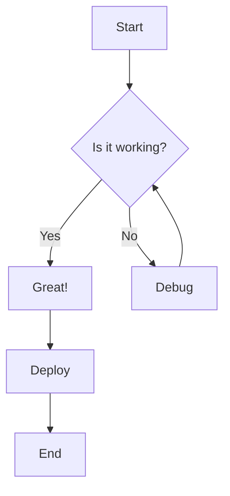
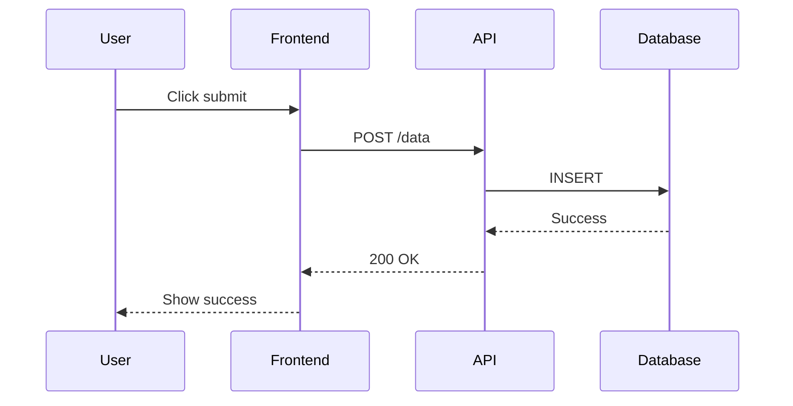
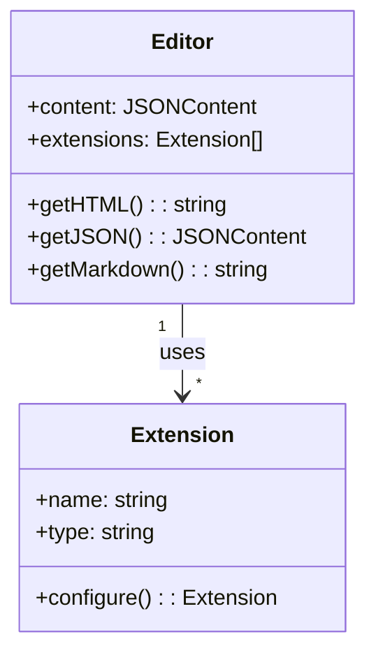
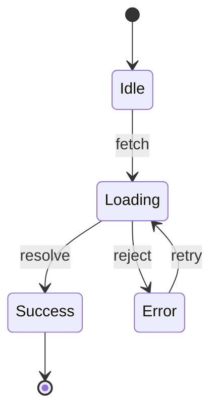
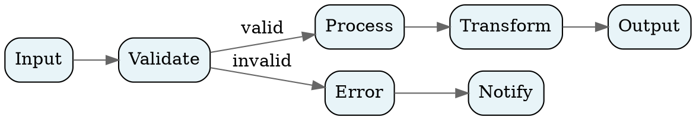
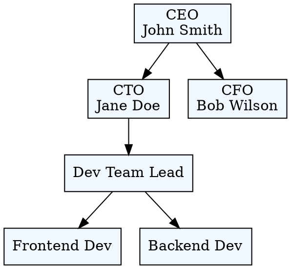

# Vizel Editor Feature Showcase

Welcome to the **Vizel Editor** - a block-based visual editor for Markdown. This document demonstrates all available features.

---

## Text Formatting

Vizel supports rich text formatting. Try selecting text to see the **bubble menu**.

- **Bold text** - `Cmd+B`
- *Italic text* - `Cmd+I`
- ~~Strikethrough~~ - select and click S
- <u>Underlined text</u> - `Cmd+U`
- `Inline code` - select and click code button

You can also combine formats: ***bold and italic***, **`bold code`**, or ~~*strikethrough italic*~~.

---

## Headings

Use slash commands or keyboard shortcuts to create headings:

### Heading 3 - `Cmd+Alt+3`

Type `/heading` or use shortcuts:
- `Cmd+Alt+1` for Heading 1
- `Cmd+Alt+2` for Heading 2
- `Cmd+Alt+3` for Heading 3

---

## Lists

### Bullet List

- First item
- Second item
  - Nested item
  - Another nested item
- Third item

### Numbered List

1. Step one
2. Step two
   1. Sub-step A
   2. Sub-step B
3. Step three

### Task List

Create with `[ ]` or `/task`:

- [x] Completed task
- [x] Another done task
- [ ] Pending task
- [ ] Future task
  - [ ] Nested subtask

---

## Blockquotes

> This is a blockquote. Use `>` at the start of a line or type `/quote`.
>
> Blockquotes can span multiple paragraphs.

---

## Links

Links are created automatically when you paste URLs: https://tiptap.dev

Or use the bubble menu to [add a custom link](https://vizel.dev).

---

## Horizontal Rules

Use `---`, `***`, or `___` followed by space, or type `/divider`:

---

## Tables

Tables support alignment, row/column insertion, and cell merging. Hover over borders to insert rows/columns. Click handles for more options.

| Feature | Shortcut | Description |
|:--------|:--------:|------------:|
| Bold | `Cmd+B` | Make text bold |
| Italic | `Cmd+I` | Make text italic |
| Undo | `Cmd+Z` | Undo last action |
| Redo | `Cmd+Shift+Z` | Redo action |

---

## Code Blocks

Type `/code` to insert a code block. Select language from the dropdown.

```typescript
import { createVizelExtensions, type VizelFeatureOptions } from "@vizel/core";
import { Vizel } from "@vizel/react";

const features: VizelFeatureOptions = {
  mathematics: true,
  diagram: true,
  embed: true,
};

function Editor() {
  return <Vizel initialMarkdown="# Hello World" features={features} />;
}
```

```python
def fibonacci(n: int) -> list[int]:
    """Generate Fibonacci sequence up to n terms."""
    if n <= 0:
        return []
    elif n == 1:
        return [0]
    
    fib = [0, 1]
    for _ in range(2, n):
        fib.append(fib[-1] + fib[-2])
    return fib

# Example usage
print(fibonacci(10))  # [0, 1, 1, 2, 3, 5, 8, 13, 21, 34]
```

```sql
SELECT 
    u.name,
    COUNT(o.id) AS order_count,
    SUM(o.total) AS total_spent
FROM users u
LEFT JOIN orders o ON u.id = o.user_id
WHERE o.created_at >= '2024-01-01'
GROUP BY u.id
HAVING total_spent > 1000
ORDER BY total_spent DESC;
```

---

## Mathematics (LaTeX)

Inline math: The equation $E = mc^2$ describes mass-energy equivalence.

The quadratic formula is $x = \frac{-b \pm \sqrt{b^2 - 4ac}}{2a}$.

Block equations:

$$
\int_{-\infty}^{\infty} e^{-x^2} dx = \sqrt{\pi}
$$

$$
\sum_{n=1}^{\infty} \frac{1}{n^2} = \frac{\pi^2}{6}
$$

$$
\nabla \times \mathbf{E} = -\frac{\partial \mathbf{B}}{\partial t}
$$

Click on any math expression to edit it.

---

## Mermaid Diagrams

Type `/mermaid` to insert diagrams. Click to edit the Mermaid code.

### Flowchart



### Sequence Diagram



### Class Diagram



### State Diagram



---

## GraphViz Diagrams

Type `/graphviz` for DOT language diagrams.

### Directed Graph



### Organizational Chart



---

## Collapsible Details

Type `/details` to create collapsible sections.

<details>
<summary>Click to expand - Feature List</summary>

This content is hidden by default.

- Text formatting
- Lists and task lists
- Tables with controls
- Code syntax highlighting
- Mathematics with KaTeX
- Mermaid diagrams
- GraphViz diagrams
- And more...

</details>

<details>
<summary>Advanced Configuration Example</summary>

```typescript
const features = {
  codeBlock: {
    defaultLanguage: "typescript",
    lineNumbers: true,
  },
  table: {
    resizable: true,
    controls: true,
  },
  image: {
    onUpload: async (file) => {
      const formData = new FormData();
      formData.append("file", file);
      const res = await fetch("/upload", { method: "POST", body: formData });
      const { url } = await res.json();
      return url;
    },
  },
};
```

</details>

---

## Images

Images support drag-and-drop upload, paste from clipboard, and resizing. Type `/image` or `/upload`.

Drag the handles on the sides to resize:


---

## Drag & Drop Blocks

Hover over any block to see the drag handle on the left. You can:

- **Drag blocks** to reorder them
- Use **Alt+↑** to move a block up
- Use **Alt+↓** to move a block down

This works for paragraphs, headings, lists, and all other block types.

---

## Slash Commands

Type `/` anywhere to open the command menu. Available commands:

| Category | Commands |
|:---------|:---------|
| **Text** | Heading 1, Heading 2, Heading 3 |
| **Lists** | Bullet List, Numbered List, Task List |
| **Blocks** | Quote, Divider, Details, Code Block, Table |
| **Media** | Image, Upload Image |
| **Advanced** | Math Equation, Inline Math, Mermaid, GraphViz |

The menu supports fuzzy search - try typing `/todo` to find Task List.

---

## Keyboard Shortcuts

| Action | Mac | Windows/Linux |
|:-------|:----|:--------------|
| Bold | `⌘+B` | `Ctrl+B` |
| Italic | `⌘+I` | `Ctrl+I` |
| Underline | `⌘+U` | `Ctrl+U` |
| Strikethrough | `⌘+Shift+S` | `Ctrl+Shift+S` |
| Heading 1 | `⌘+Alt+1` | `Ctrl+Alt+1` |
| Heading 2 | `⌘+Alt+2` | `Ctrl+Alt+2` |
| Heading 3 | `⌘+Alt+3` | `Ctrl+Alt+3` |
| Bullet List | `⌘+Shift+8` | `Ctrl+Shift+8` |
| Ordered List | `⌘+Shift+7` | `Ctrl+Shift+7` |
| Blockquote | `⌘+Shift+B` | `Ctrl+Shift+B` |
| Code Block | `⌘+Alt+C` | `Ctrl+Alt+C` |
| Undo | `⌘+Z` | `Ctrl+Z` |
| Redo | `⌘+Shift+Z` | `Ctrl+Shift+Z` |
| Move Block Up | `Alt+↑` | `Alt+↑` |
| Move Block Down | `Alt+↓` | `Alt+↓` |

---

## Auto-Save

The editor automatically saves your content to localStorage. Look for the save indicator in the status bar below the editor.

---

## Dark Mode

Click the theme toggle in the header to switch between light, dark, and system themes. The editor and all components respect the theme setting.

---

*This document showcases all features of the Vizel Editor. Start editing to explore!*
