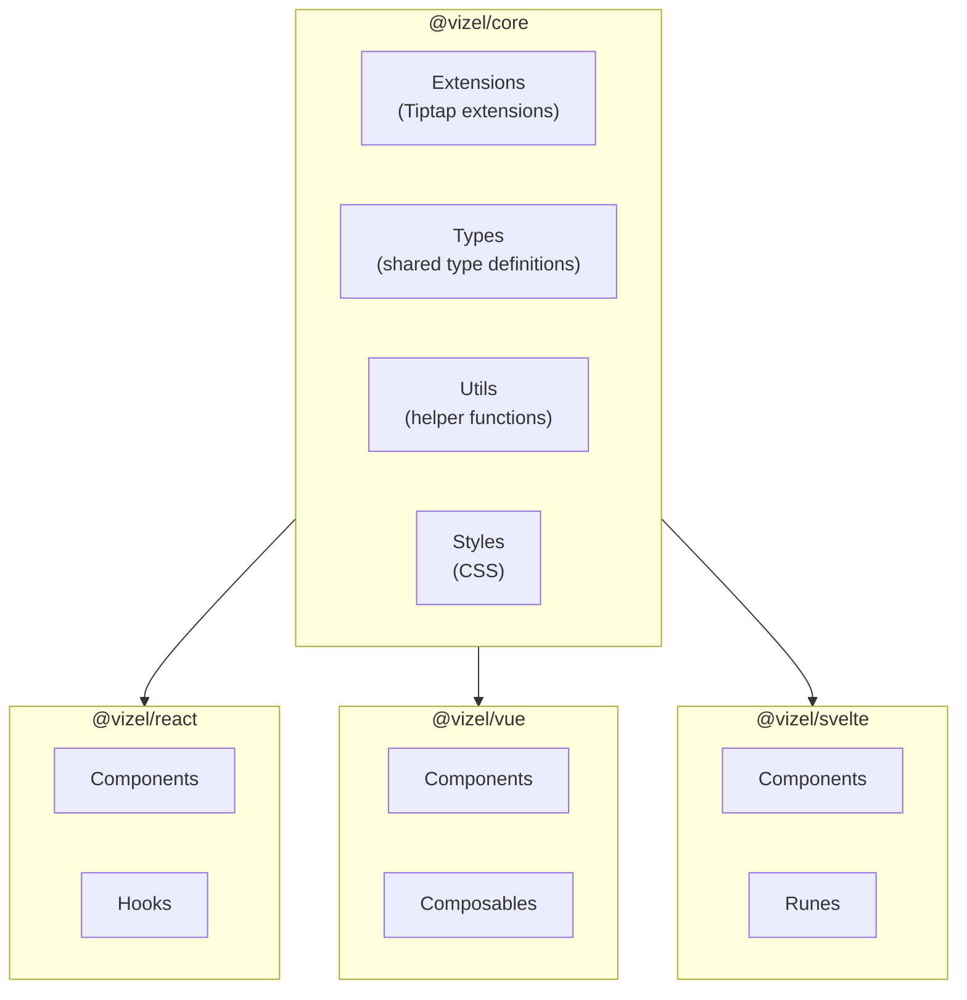

# API Reference

## Overview

Vizel provides a consistent API across all supported frameworks. The core package contains framework-agnostic extensions and utilities, while the framework-specific packages provide components and state management primitives.

## Packages

- [@vizel/core](/api/core) - Core extensions and utilities
- [@vizel/react](/api/react) - React components and hooks
- [@vizel/vue](/api/vue) - Vue components and composables
- [@vizel/svelte](/api/svelte) - Svelte components and runes

## Architecture

