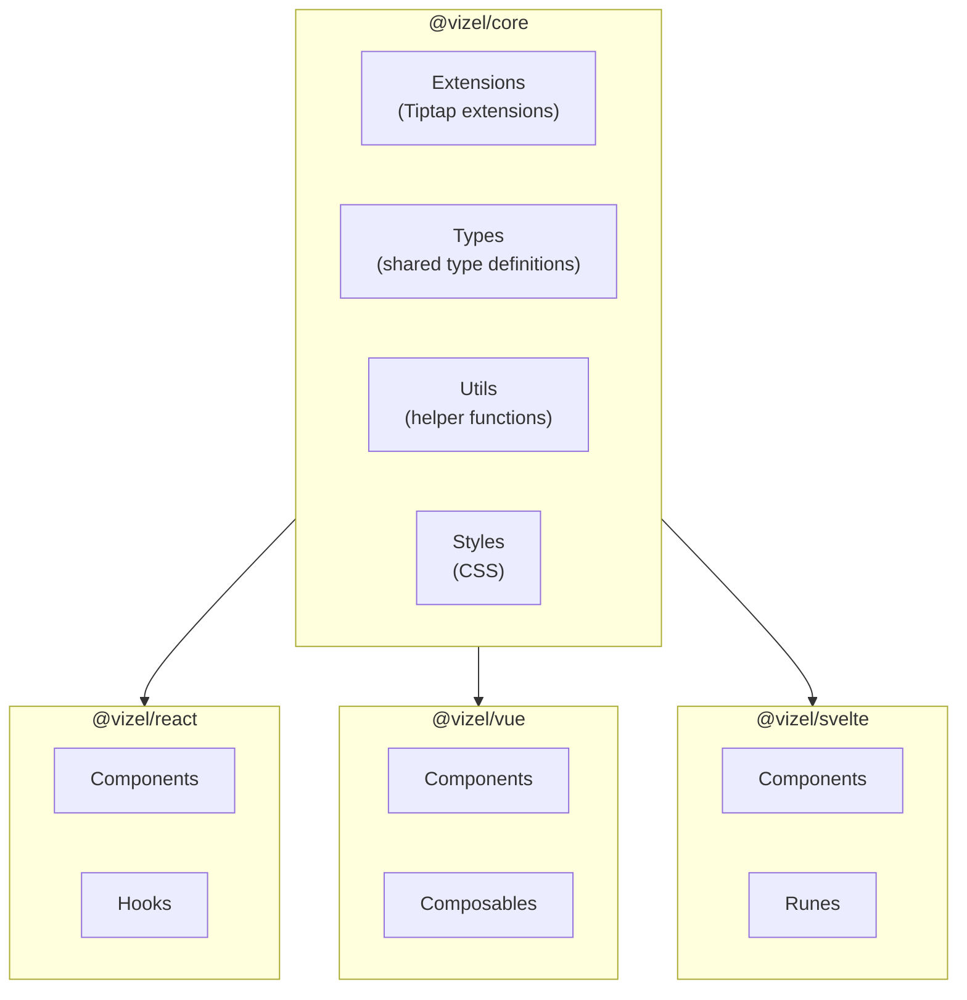

# API Reference

## Overview

Vizel provides a consistent API across all supported frameworks. The core package contains framework-agnostic extensions and utilities, while the framework-specific packages provide components and state management primitives.

## Hand-written guides

- [@vizel/core](/api/core) - Core extensions and utilities
- [@vizel/react](/api/react) - React components and hooks
- [@vizel/vue](/api/vue) - Vue components and composables
- [@vizel/svelte](/api/svelte) - Svelte components and runes

## TypeDoc-generated reference

The auto-generated reference below mirrors every JSDoc-documented symbol
in the four package entries. Run `pnpm docs:api` from the repository
root to regenerate it; the output lives at `docs/api/generated/` and is
gitignored so each contributor materializes a fresh copy locally.

- [Generated index](/api/generated/) — module overview
- Or expand the **Generated Reference** section in the sidebar to jump
  straight to a class, interface, type, or function.

## Architecture

```mermaid
graph TB
    subgraph core["@vizel/core"]
        Extensions["Extensions<br/>(Tiptap extensions)"]
        Types["Types<br/>(shared type definitions)"]
        Utils["Utils<br/>(helper functions)"]
        Styles["Styles<br/>(CSS)"]
    end

    subgraph react["@vizel/react"]
        ReactComponents["Components"]
        ReactHooks["Hooks"]
    end

    subgraph vue["@vizel/vue"]
        VueComponents["Components"]
        VueComposables["Composables"]
    end

    subgraph svelte["@vizel/svelte"]
        SvelteComponents["Components"]
        SvelteRunes["Runes"]
    end

    core --> react
    core --> vue
    core --> svelte
```
