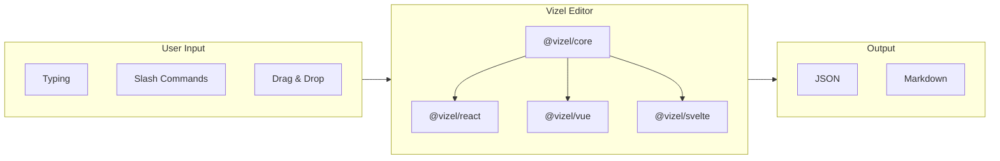
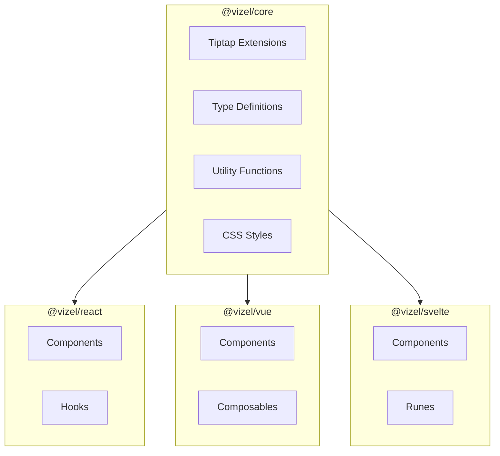

# What is Vizel?

Vizel is a block-based visual editor for Markdown built with [Tiptap](https://tiptap.dev/), supporting React, Vue, and Svelte frameworks.

## Overview

## Key Features

### Rich Text Editing

- **Text Formatting** - Bold, italic, underline, strikethrough, text color, highlight
- **Block Elements** - Headings (H1-H6), lists (bullet, numbered, task), blockquotes
- **Code Blocks** - Syntax highlighting with 190+ languages via [Shiki](https://shiki.style/)

### Block-Based Experience

- **Slash Commands** - Type `/` to quickly insert any block type
- **Bubble Menu** - Context-aware formatting toolbar on text selection
- **Drag Handle** - Reorder blocks with drag and drop

### Rich Media

- **Images** - Drag & drop, paste from clipboard, resize with handles
- **Tables** - Full table editing with row/column controls
- **Embeds** - YouTube, Vimeo, Twitter, and more via oEmbed
- **Mathematics** - LaTeX equations rendered with KaTeX
- **Diagrams** - Mermaid and GraphViz diagram support

### Developer Experience

- **TypeScript** - Full type safety with comprehensive definitions
- **Multi-Framework** - Consistent APIs across React, Vue, and Svelte
- **Extensible** - Built on Tiptap's modular architecture
- **Lightweight** - Tree-shakeable packages with minimal bundle impact

## Package Architecture

| Package | Description |
|---------|-------------|
| `@vizel/core` | Framework-agnostic core with Tiptap extensions, types, utilities, and styles |
| `@vizel/react` | React 19 components and hooks |
| `@vizel/vue` | Vue 3 components and composables |
| `@vizel/svelte` | Svelte 5 components and runes |

## Feature Comparison

| Feature | Default | Optional |
|---------|:-------:|:--------:|
| Text Formatting | :white_check_mark: | - |
| Headings | :white_check_mark: | - |
| Lists (Bullet, Numbered) | :white_check_mark: | - |
| Task Lists | :white_check_mark: | - |
| Blockquotes | :white_check_mark: | - |
| Code Blocks | :white_check_mark: | - |
| Tables | :white_check_mark: | - |
| Links | :white_check_mark: | - |
| Images | :white_check_mark: | - |
| Slash Commands | :white_check_mark: | - |
| Drag Handle | :white_check_mark: | - |
| Character Count | :white_check_mark: | - |
| Text Color / Highlight | :white_check_mark: | - |
| Markdown Import/Export | - | :white_check_mark: |
| Mathematics (LaTeX) | - | :white_check_mark: |
| Embeds (oEmbed) | - | :white_check_mark: |
| Collapsible Details | - | :white_check_mark: |
| Diagrams (Mermaid) | - | :white_check_mark: |

## Quick Start

Choose your framework to get started:

- [React](/guide/react) - React 19 with hooks
- [Vue](/guide/vue) - Vue 3 with Composition API
- [Svelte](/guide/svelte) - Svelte 5 with runes

Or jump directly to:

- [Getting Started](/guide/getting-started) - Installation and basic setup
- [Configuration](/guide/configuration) - Editor options and customization
- [Features](/guide/features) - Enable and configure features
- [Theming](/guide/theming) - Customize appearance with CSS variables
